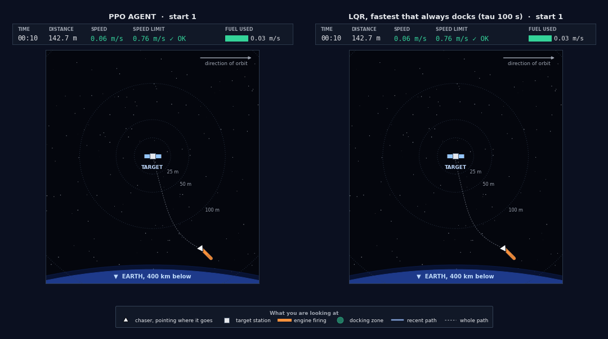
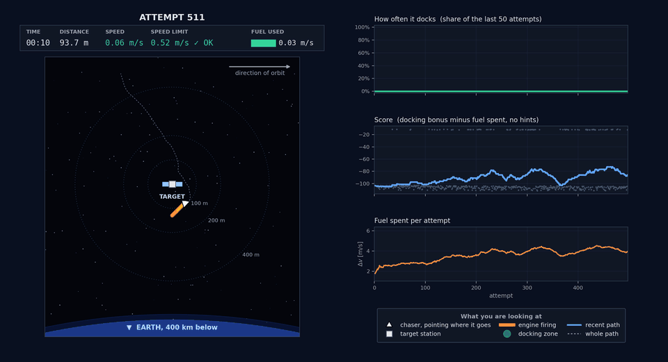
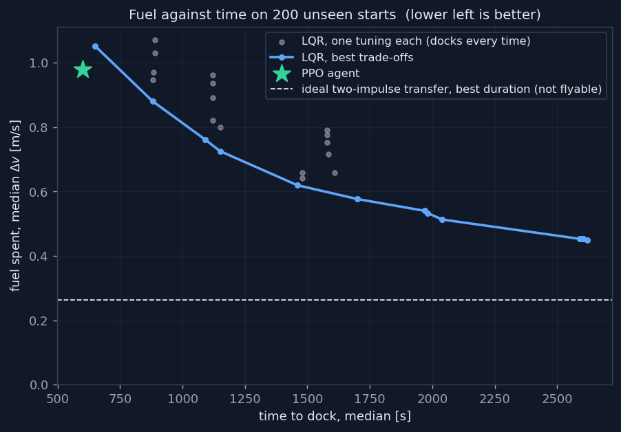
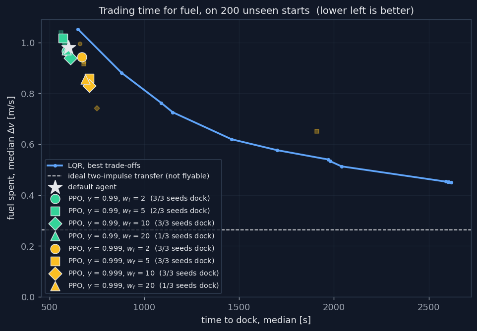
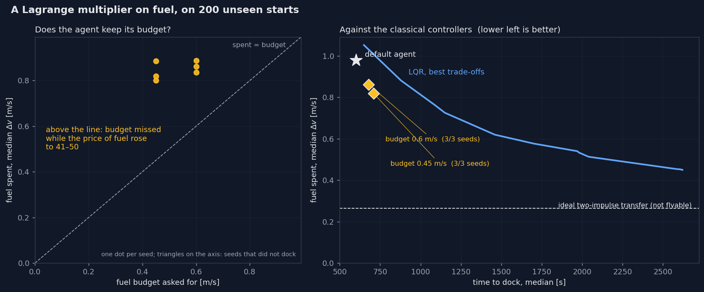
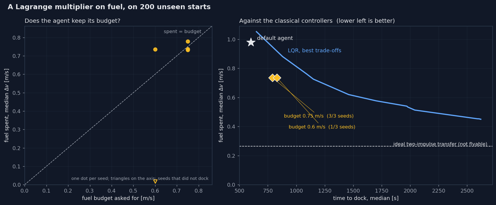
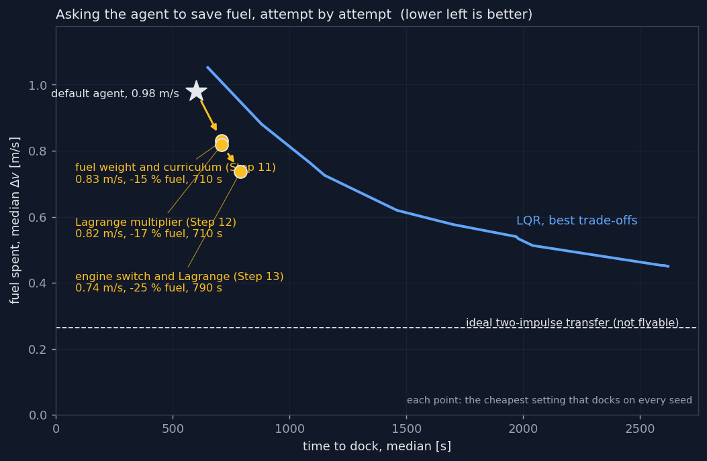
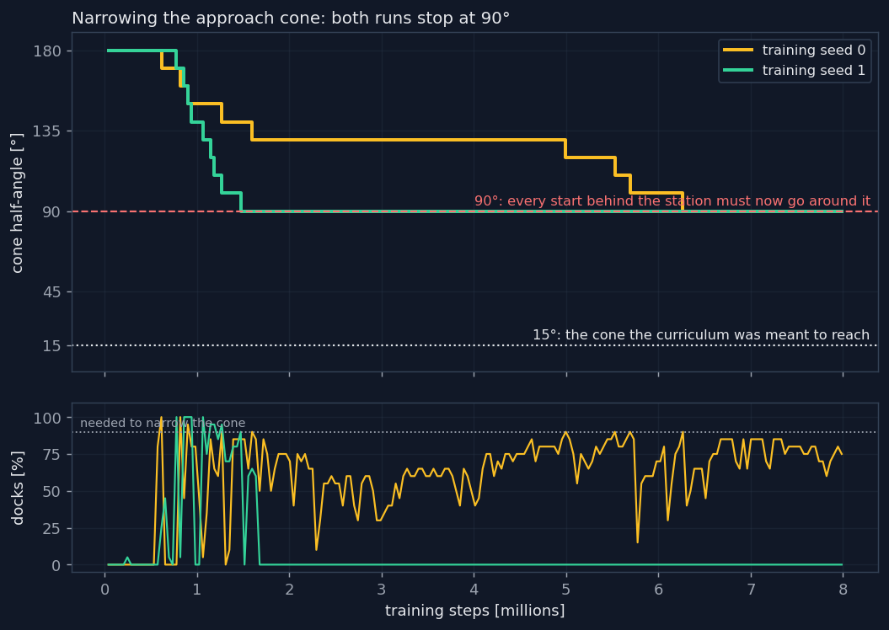
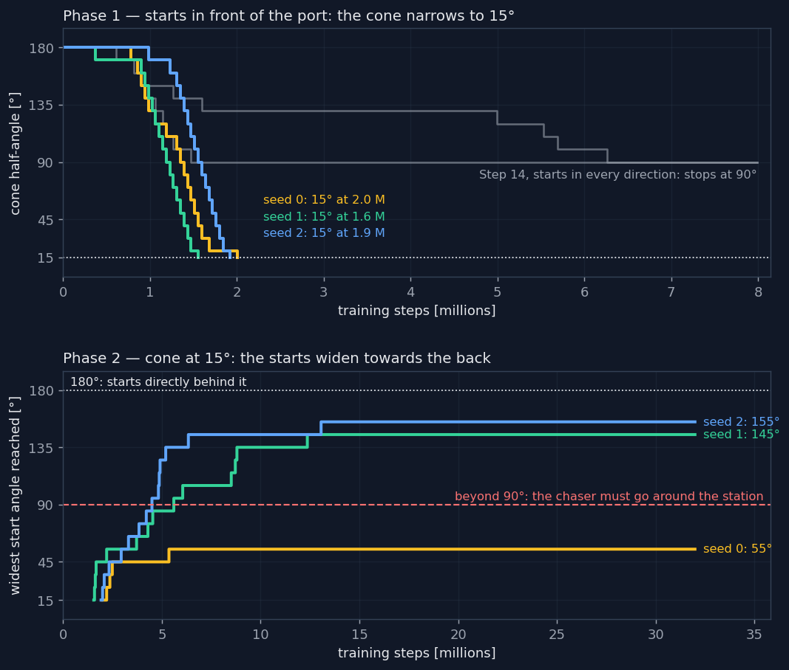
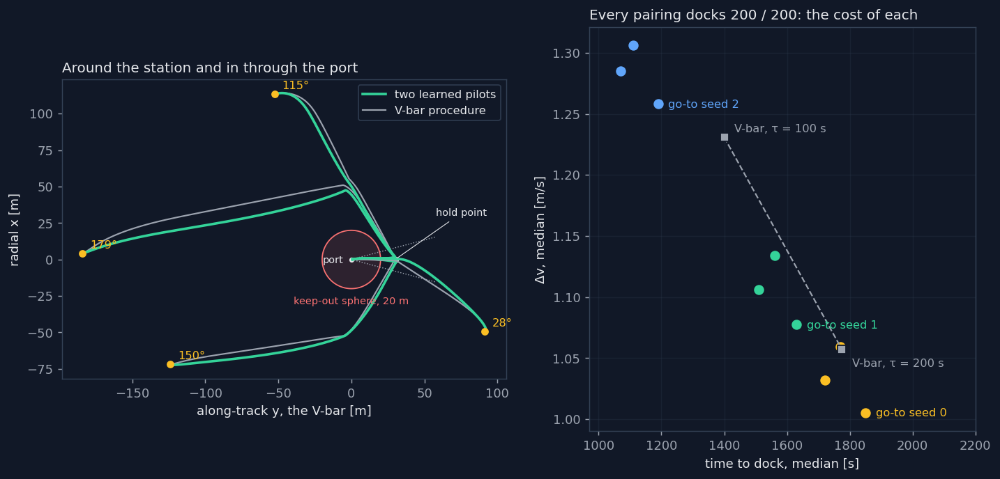

# Orbital Rendezvous

A reinforcement learning agent that learns, by trial and error, to fly a chaser
spacecraft onto a target in low Earth orbit. The relative motion follows the
Clohessy-Wiltshire equations, propagated exactly; the agent is trained with PPO
and compared, on identical starting conditions, with a sweep of LQR controllers
and with the ideal two-impulse transfer.



*The trained agent (left) and the fastest LQR controller that never crashes
(right), from the same starting point never seen in training. The status bars
compare them directly: time, distance, speed against the speed limit, and fuel
used.*

**Key results**, on 200 starting points never seen in training:

- the agent docks **199 times out of 200**, after 2 million training steps,
  about two minutes on a laptop, and between 197 and 200 out of 200 over three
  training seeds;
- it docks in a median $`600\ \text{s}`$ for $`0.98\ \text{m/s}`$ of
  $`\Delta v`$: sooner **and** cheaper than the fastest LQR controller that
  never crashes ($`650\ \text{s}`$, $`1.05\ \text{m/s}`$), whose more aggressive
  tunings crash in up to 68 % of the attempts;
- a patient LQR spends less than half the fuel in four times the time, and the
  ideal two-impulse transfer less than a third: the agent learned a *quick*
  approach, not a fuel-optimal one. Asked to save fuel, it gets to 25 % less
  (0.74 m/s in 790 s) with an engine switch and a Lagrange multiplier on a fuel
  budget; how, and why not further, is the subject of three studies below.
  Asked to dock through a port, along a narrow approach corridor, a single
  agent docks at best 153 times in 200; two learned pilots flying the plan of
  the classical V-bar procedure dock **200 times in 200**, with no violation,
  on all nine pairings of trained seeds, at much the procedure's cost.

## Contents

1. [Physics](#physics)
2. [The control problem](#the-control-problem)
3. [Classical baselines](#classical-baselines)
4. [Results](#results)
5. [Discussion and limitations](#discussion-and-limitations)
6. [Getting started](#getting-started)
7. [Repository layout](#repository-layout)
8. [Tests](#tests)
9. [Roadmap](#roadmap)
10. [References](#references)

## Physics

### Relative motion near a circular orbit

The target flies a circular orbit of semi-major axis $`a`$, with mean motion
$`n = \sqrt{\mu/a^3}`$. The chaser is described in the LVLH frame centred on the
target, with $`x`$ radial (pointing away from the Earth) and $`y`$ along-track
(in the direction of motion). For separations much smaller than $`a`$, the
linearised relative motion of a chaser of mass $`m`$ under a thrust
$`\mathbf{u}`$ obeys the Clohessy-Wiltshire (Hill) equations [1, 2]:

```math
\ddot{x} - 3n^2 x - 2n\dot{y} = \frac{u_x}{m}, \qquad
\ddot{y} + 2n\dot{x} = \frac{u_y}{m}, \qquad
\ddot{z} + n^2 z = \frac{u_z}{m}
```

The out-of-plane motion $`z`$ is a harmonic oscillator fully decoupled from the
in-plane axes, so it is left out: it would double the training cost without
adding any coupling to learn. The target orbits at $`400\ \text{km}`$ of
altitude, $`a = 6778\ \text{km}`$, which gives $`n = 1.131 \times 10^{-3}\ \text{rad/s}`$
and an orbital period of $`92.6`$ minutes.

### A linear system, propagated exactly

On the state $`\mathbf{s} = [x, y, \dot{x}, \dot{y}]^T`$ the in-plane equations
form a linear time-invariant system $`\dot{\mathbf{s}} = A\mathbf{s} + B\mathbf{u}`$:

```math
A = \begin{pmatrix} 0&0&1&0 \\ 0&0&0&1 \\ 3n^2&0&0&2n \\ 0&0&-2n&0 \end{pmatrix},
\qquad
B = \frac{1}{m}\begin{pmatrix} 0&0 \\ 0&0 \\ 1&0 \\ 0&1 \end{pmatrix}
```

A system with constant coefficients has an exact solution,
$`\mathbf{s}(t) = \Phi(t)\,\mathbf{s}(0)`$ with $`\Phi(t) = e^{At}`$. A numerical
integrator such as Runge-Kutta would give the same answer with a truncation
error, run slower, and leave nothing exact to test against. With $`\tau = nt`$,
$`s = \sin\tau`$ and $`c = \cos\tau`$, the state-transition matrix is the
classical closed form [3]:

```math
\Phi(t) = \begin{pmatrix}
4-3c & 0 & \dfrac{s}{n} & \dfrac{2(1-c)}{n} \\[2mm]
6(s-\tau) & 1 & -\dfrac{2(1-c)}{n} & \dfrac{4s-3\tau}{n} \\[2mm]
3ns & 0 & c & 2s \\[2mm]
-6n(1-c) & 0 & -2s & 4c-3
\end{pmatrix}
```

Two properties can be read directly off this matrix.

**The secular drift.** The entry $`6(s-\tau)`$ grows linearly in time: a radial
offset $`x_0`$ produces an along-track drift of $`-6 n x_0 t`$ on average,
exactly $`-12\pi x_0`$ per orbit. This is what makes a rendezvous
counter-intuitive. A chaser below the target ($`x_0 \lt 0`$) moves faster and
drifts ahead; thrusting straight at a target in front raises the orbit, slows
the chaser down and leaves it further behind. To catch up, one has to go down.

**Closed relative orbits.** The column of $`\dot{y}`$ contains $`4s - 3\tau`$.
With $`\dot{y}_0 = -2 n x_0`$ the secular terms cancel, and the relative orbit
closes into a periodic ellipse twice as long along-track as it is radially.

**Hold points on the V-bar.** The second column of $`\Phi`$ is
$`(0, 1, 0, 0)^T`$: a chaser at rest anywhere on the along-track axis,
$`x = 0`$, stays there. Points on this axis, the V-bar, are equilibria, which is
why real missions to the ISS stop at hold points on it before the final
approach.

### Thrust held over a step

The agent chooses a thrust every $`\Delta t`$ and holds it constant over the step
(a zero-order hold). The state then advances as
$`\mathbf{s}_{k+1} = \Phi\,\mathbf{s}_k + \Gamma\,\mathbf{u}_k`$, with

```math
\Gamma(\Delta t) = \int_0^{\Delta t} \Phi(\Delta t - \sigma)\, B \,\mathrm{d}\sigma
```

This integral has a closed form, but a long one that is easy to get wrong by
hand. It is computed instead with Van Loan's method [4]: a single exponential of
a block matrix contains both matrices,

```math
\exp\left( \begin{pmatrix} A & B \\ 0 & 0 \end{pmatrix} \Delta t \right)
= \begin{pmatrix} \Phi & \Gamma \\ 0 & I \end{pmatrix}
```

The result is exact, not an approximation, for any $`\Delta t`$, and it is
evaluated once when the environment is built, so a simulation step costs two
small matrix products. It also gives the strongest available check on the
physics: the $`\Phi`$ obtained this way must agree with the closed form above to
machine precision, and it does.

## The control problem

### Environment

The environment follows the Gymnasium interface [5].

| | |
| --- | --- |
| **action** | $`a \in [-1, 1]^2`$, thrust $`\mathbf{u} = u_\mathrm{max}\,a`$ saturated per axis, $`u_\mathrm{max} = 1\ \text{N}`$ |
| **observation** | $`[x/r_\mathrm{max},\ y/r_\mathrm{max},\ \dot{x}/v_\mathrm{ref},\ \dot{y}/v_\mathrm{ref},\ t/T_\mathrm{max}]`$, with $`r_\mathrm{max} = 500\ \text{m}`$, $`v_\mathrm{ref} = 0.5\ \text{m/s}`$ and $`T_\mathrm{max} = 3000\ \text{s}`$ |
| **start** | a random distance $`r_0 \in [80, 200]\ \text{m}`$ in a random direction, with a small random velocity |
| **step** | $`\Delta t = 10\ \text{s}`$, at most 300 steps ($`3000\ \text{s}`$) |
| **docked** | inside $`1\ \text{m}`$ of the target and slower than $`0.05\ \text{m/s}`$ |
| **crashed** | inside $`1\ \text{m}`$, too fast |
| **escaped** | further than $`500\ \text{m}`$ |
| **timeout** | the step limit: a true end of the episode, not penalised |

The chaser has a mass of $`500\ \text{kg}`$, so its acceleration is at most
$`2\ \text{mm/s}^2`$ per axis. The thrust is continuous rather than a set of
on/off burns: closer to a throttleable engine, and easier to learn, because the
agent can correct gently. The observation is normalised because positions are
hundreds of metres and velocities centimetres per second; fed raw, the network
would barely see the velocities. The start is random so that the agent learns a
strategy rather than memorising a trajectory.

The last component of the observation is the clock. Without it, the same
position and velocity early and late in an episode would look identical to the
agent although their futures differ, and the problem would not be Markovian.
With the clock observed, the time limit is part of the task, so the timeout is
treated as a true end of the episode rather than an interruption to bootstrap
from [9]. It carries no penalty: the agent should not learn to fear the clock
itself.

At a few metres per second the chaser can cover more than the docking diameter
in one step, and fly through the target with neither end of the step inside the
docking sphere. The outcome is therefore decided on the closest approach of the
whole segment travelled during the step.

### Reward

A naive reward for getting closer can be farmed, by oscillating back and forth,
and in general changes which policy is optimal. The reward is instead shaped
with a potential [6]: with a potential $`\Phi(\mathbf{s})`$, high where the agent
should be, each step adds

```math
F = \gamma\,\Phi(\mathbf{s}') - \Phi(\mathbf{s})
```

Over any trajectory the discounted sum of these terms telescopes,

```math
\sum_{k=0}^{K-1} \gamma^k F_k = \gamma^K \Phi(\mathbf{s}_K) - \Phi(\mathbf{s}_0)
```

so it depends only on the two ends: nothing can be farmed, and the optimal
policy is provably the same as without shaping. The shaping speeds learning up
without moving the target. The potential of a terminated state is taken as
zero, which keeps the equivalence exact on episodic tasks. The potential used
here is

```math
\Phi(\mathbf{s}) = -\,w_r\,\frac{r}{r_\mathrm{max}} \;-\; w_v\,\frac{\max\left(0,\ |\mathbf{v}| - v_\mathrm{max}(r)\right)}{v_\mathrm{ref}},
\qquad
v_\mathrm{max}(r) = v_\mathrm{dock} + \frac{r}{\tau}
```

The first term pulls the chaser in. The second is a speed limit that tightens on
approach, a *glide slope*: with $`\tau = 200\ \text{s}`$ it allows
$`0.55\ \text{m/s}`$ at $`100\ \text{m}`$, $`0.10\ \text{m/s}`$ at $`10\ \text{m}`$,
and exactly the docking speed at the target. Without it, the first term alone
would teach the agent to rush in and crash.

Two further terms are real costs, meant to change the optimal policy: the fuel
spent in each step, $`-w_f\,|\mathbf{u}|\,\Delta t/m`$, and a terminal reward of
$`+100`$ on docking and $`-100`$ on a crash or an escape. The weights are
$`w_r = 20`$, $`w_v = 10`$ and $`w_f = 2`$ per $`\text{m/s}`$: flying in from
$`200\ \text{m}`$ earns $`20 \cdot 200/500 = +8`$ of shaping, an efficient
approach costs about $`-2`$ of fuel.

### Choosing the timescale of the decisions

With a discount $`\gamma`$ the agent effectively looks
$`1/(1-\gamma)`$ steps ahead, 100 steps for $`\gamma = 0.99`$. An approach
along the glide slope, $`\dot r = -r/\tau`$, takes

```math
t \approx \tau \ln\frac{r_0}{r_\mathrm{dock}} = 200 \ln 200 \approx 1060\ \text{s}
```

so the time step fixes whether the agent can see the end of its own manoeuvre.
A first training run used $`\Delta t = 1\ \text{s}`$: the horizon was 100
seconds, the docking bonus arrived about 1000 steps later and was worth
$`100 \cdot 0.99^{1000} \approx 0.004`$, and the agent never learned to approach
(0 % docking, median closest approach $`133\ \text{m}`$). With
$`\Delta t = 10\ \text{s}`$ the same 100 steps span $`1000\ \text{s}`$; since the
propagation is exact for any step, the physics is unchanged, and only the rate
of the decisions is.

### Training

PPO [7] from Stable-Baselines3 [8], on 8 parallel environments:

| | |
| --- | --- |
| network | two hidden layers of 64 units, for the policy and the value function |
| rollout | 512 steps per environment, a bit under two episodes |
| minibatch | 256 |
| learning rate | $`3 \times 10^{-4}`$ |
| discount, GAE | $`\gamma = 0.99`$, $`\lambda = 0.95`$ |
| clip range | 0.2 |
| total | 2 million steps, about 20 000 episodes, about 2 minutes on a laptop |

The shaping discount must equal the training discount, or the shaping is no
longer guaranteed to leave the optimal policy unchanged; loading a configuration
where the two differ is an error.

## Classical baselines

### LQR

On the exact discrete dynamics, the infinite-horizon LQR minimises

```math
J = \sum_k \mathbf{s}_k^T Q\,\mathbf{s}_k + \mathbf{u}_k^T R\,\mathbf{u}_k
```

through the discrete algebraic Riccati equation,

```math
P = Q + \Phi^T P \Phi - \Phi^T P \Gamma \left(R + \Gamma^T P \Gamma\right)^{-1} \Gamma^T P \Phi,
\qquad
\mathbf{u}_k = -K\mathbf{s}_k, \quad K = \left(R + \Gamma^T P \Gamma\right)^{-1}\Gamma^T P \Phi
```

with the thrust saturated at the same limit as the agent. When fuel is free,
the balance between a position error $`q_r r^2`$ and a speed $`q_v v^2`$ is an
exponential approach $`\dot r = -r/\tau`$ with $`\tau = \sqrt{q_v/q_r}`$: the
velocity weight acts as an implicit glide slope. The controller is therefore
parametrised physically,

```math
Q = \frac{1}{r_\mathrm{ref}^2}\,\mathrm{diag}\left(1, 1, \tau^2, \tau^2\right),
\qquad
R = \frac{w}{u_\mathrm{max}^2}\, I
```

by the time constant $`\tau`$ of that glide slope and by a fuel weight $`w`$ that
trades time for fuel on top of it. Note that the LQR penalises
$`|\mathbf{u}|^2`$, while the fuel actually paid is $`\sum|\mathbf{u}|`$: a
quadratic cost prefers to thrust a little all the time, whereas $`\Delta v`$ is
minimised by a few decisive burns. The LQR is a solid classical controller, not
a fuel-optimal bound.

### Two-impulse transfer

The textbook reference for $`\Delta v`$ [3]. A first impulse sets the velocity
that reaches the origin after a time $`T`$; a second one cancels the arrival
velocity. From the position and velocity blocks of $`\Phi(T)`$,

```math
\mathbf{v}_0^+ = -\Phi_{rv}^{-1}\Phi_{rr}\,\mathbf{r}_0,
\qquad
\Delta v = \left|\mathbf{v}_0^+ - \mathbf{v}_0\right| + \left|\Phi_{vr}\mathbf{r}_0 + \Phi_{vv}\mathbf{v}_0^+\right|
```

minimised over $`T`$ up to the length of an episode, skipping the durations where
$`\Phi_{rv}`$ is singular, at multiples of the orbital period. Impulses are
instantaneous and ignore the thrust limit, so this is a reference number, not a
controller that can fly in the environment.

### The V-bar procedure

For an oriented target (see *An oriented target* in the results) the reference
is the procedure real missions fly. An LQR brings the chaser to a hold point on
the V-bar, 30 m out, first via a waypoint beside the keep-out sphere if the
direct way would cross it. The chaser then tracks a reference sliding down the
axis at $`v_c = 4\ \text{cm/s}`$ to the port. Staying on the axis while moving
along it needs a steady radial thrust against the Coriolis term: with $`x = 0`$
and $`\dot{y} = -v_c`$ the first Clohessy-Wiltshire equation gives

```math
u_x = 2\,n\,v_c\,m
```

## Results

### Learning



*Four replays from one training run, with the curves as they stood at that
moment: after about 500 attempts the agent drifts off and is lost in space;
around 1500 it has learned to close in but stops short of the target; around
2500 it docks about half the time; by the end it docks cleanly almost every
time, on a fraction of the fuel it burnt while learning.*

The docking rate is 5 % over the first 2000 episodes, 85 % over the next 2000,
and 97 to 98 % from there on. The fuel curve rises first and falls later: the
agent first discovers that moving pays, and burns up to $`5.5\ \text{m/s}`$ per
attempt; once it docks reliably, it learns to do so on about $`1\ \text{m/s}`$.
Two runs with the same seed give identical numbers.

The window above is also what one watches during training. The curves plotted
are the docking rate and the *true* score, fuel plus terminal reward, without
the shaping term. With $`\gamma \lt 1`$ and a negative potential, a step spent
standing still earns $`(\gamma - 1)\,\Phi \gt 0`$, so the shaped undiscounted
return rewards wandering and would make a poor agent look good. The network
losses are not plotted either: in reinforcement learning they do not fall as
they do in supervised learning, because the policy changes the data it
collects, and they do not say whether the agent is improving.

### Comparison with the classical baselines



Every controller is flown on the same 200 starting points, none of which was
seen in training. Rather than picking one LQR tuning by hand, which could favour
the agent without meaning to, 54 of them are swept: $`\tau`$ from 50 to
$`300\ \text{s}`$ and $`w`$ from $`10^{-4}`$ to 1. Only those that dock every time
compete; their best trade-offs form the blue curve.

| | docked | $`\Delta v`$, median (5–95 %) | time, median | speed at docking |
| --- | --- | --- | --- | --- |
| PPO agent, deterministic | 199 / 200 | 0.98 m/s (0.64–1.37) | 600 s | 2.9 cm/s |
| LQR, fastest that always docks | 200 / 200 | 1.05 m/s (0.71–1.48) | 650 s | 1.3 cm/s |
| LQR, cheapest that always docks | 200 / 200 | 0.45 m/s (0.25–0.80) | 2620 s | 0.2 cm/s |
| ideal two-impulse transfer | not flyable | 0.26 m/s (0.08–0.51) | 2880 s | |

The fastest reliable LQR has $`\tau = 100\ \text{s}`$ and $`w = 10^{-3}`$, the
cheapest $`\tau = 200\ \text{s}`$ and $`w = 0.3`$. More aggressive tunings do not
dock faster: they arrive too fast and crash, in up to 68 % of the attempts. The
agent's one failure is also a crash at the limit, arriving at
$`7.2\ \text{cm/s}`$ against the $`5\ \text{cm/s}`$ allowed.

### Trading time for fuel

The agent is quick but not frugal, and the first reason is the discount. A
docking bonus earned after $`K`$ steps is worth $`100\,\gamma^K`$ to the agent:
at $`\gamma = 0.99`$, docking after 60 steps ($`600\ \text{s}`$) is worth 55,
after 288 steps ($`2880\ \text{s}`$, the best two-impulse duration) only 5.5.
Arriving late forfeits about 50 points of bonus, while saving
$`0.7\ \text{m/s}`$ of fuel at $`w_f = 2`$ earns 1.4: hurrying is worth 35 times
the fuel. At $`\gamma = 0.999`$ the same late docking is still worth 75.

A study (`scripts/fuel_study.py`) trained the agent over
$`\gamma \in \{0.99,\ 0.999\}`$ and final fuel weights
$`w_f \in \{2,\ 5,\ 10,\ 20\}`$, three seeds each, 4 million steps per run, and
evaluated every run on the same 200 unseen starts.



*Left: the fuel spent against the fuel weight, one line per discount; with
$`\gamma = 0.99`$ the weight barely matters, with $`\gamma = 0.999`$ fuel falls
as it grows. Right: the best configuration against the LQR front and the
two-impulse bound; the grey dots are all the other runs that dock reliably.*

| $`\gamma`$ | $`w_f`$ | seeds that dock | $`\Delta v`$, median | time, median |
| --- | --- | --- | --- | --- |
| 0.99 | 2 | 3 / 3 | 0.97 m/s | 590 s |
| 0.99 | 5 | 2 / 3 | 1.02 m/s | 570 s |
| 0.99 | 10 | 3 / 3 | 0.94 m/s | 610 s |
| 0.99 | 20 | 1 / 3 | 0.97 m/s | 590 s |
| 0.999 | 2 | 3 / 3 | 0.94 m/s | 670 s |
| 0.999 | 5 | 3 / 3 | 0.86 m/s | 710 s |
| **0.999** | **10** | **3 / 3** | **0.83 m/s** | **710 s** |
| 0.999 | 20 | 1 / 3 | 0.86 m/s | 690 s |

*Costs are medians over the seeds that dock at least 95 % of the time; a run
that docks rarely docks only from the easy starts, and would flatter the
configuration.*

Three things stand out.

- **At $`\gamma = 0.99`$ the fuel weight barely matters**: every configuration
  spends 0.94 to 1.02 m/s in about 600 s, as the discount argument predicts.
  At $`\gamma = 0.999`$ fuel falls steadily with the weight, from 0.94 to
  0.83 m/s, while the approach slows from 670 to 710 s.
- **The best reliable configuration, $`\gamma = 0.999`$ and $`w_f = 10`$, docks
  on every seed with 15 % less fuel than the default agent**, and about 17 %
  less than the LQR front at the same time to dock, near 1.0 m/s at 710 s.
- **A heavy fuel cost reopens the trap of the first training run.** With the
  fuel weight at 5 or more from the first step, moving costs more than
  approaching earns before the docking bonus has ever been seen, and the agent
  learns to stay put. Every run therefore starts at $`w_f = 2`$ and raises it to
  its final value over the first half of training (a curriculum): learn to dock
  first, then to save. This fixes weights up to 10; at 20, two seeds in three
  still unlearn docking once the weight has risen.

One run, $`\gamma = 0.999`$ and $`w_f = 5`$ on seed 0, found a different strategy
altogether: 0.65 m/s in 1910 s, docking 199 times in 200. A slow, economical
approach exists and PPO can find it, but only by chance.

**Why the agent does not go further.** The fuel cost is paid on the thrust
actually commanded, exploration noise included. After training the policy keeps
a noise of $`\sigma \approx 0.1`$ per axis, which burns about
$`0.23\ \text{m/s}`$ per $`1000\ \text{s}`$ even with the engine nominally off:
during training, a two-impulse approach of $`2900\ \text{s}`$ would cost about
0.9 m/s, more than the fast one. A minimum thruster level was tried, so that
commands near zero leave the engine off and coasting is free. The agents did
coast, for up to 43 % of their steps, but lost the precision of the final
approach: the weakest firing, $`4 \times 10^{-4}\ \text{m/s}^2`$, is a hundred
times the tidal acceleration $`3n^2x`$ at a metre from the target, and they
circled it until the time ran out, docking only 70 to 80 % of the time and
spending no less fuel. The option is kept in the environment, off by default.

### A Lagrange multiplier on fuel

The fuel study chose the fuel weight by hand. A constrained formulation asks
instead for a budget: dock, spending at most $`D`$ of fuel [10]. The fuel weight
becomes the Lagrange multiplier of that constraint, adjusted during training by
dual ascent,

```math
\lambda \leftarrow \max\left(0,\ \lambda + \eta\,\frac{\widehat{\Delta v} - D}{D}\right)
```

where $`\widehat{\Delta v}`$ is measured every ten rollouts on twenty attempts
of the *deterministic* policy, so that exploration noise, which the trained
agent does not pay, cannot push the price up. It works like a thermostat on the
price of fuel: spending too much raises it, spending too little lowers it. The
multiplier stays at zero until the agent docks in half of those attempts, so
that fuel does not become expensive before docking is learned.



| budget $`D`$ | seeds that dock | $`\Delta v`$, median | time, median | final $`\lambda`$ per seed |
| --- | --- | --- | --- | --- |
| 0.6 m/s | 3 / 3 | 0.86 m/s | 680 s | 44, 48, 41 |
| 0.45 m/s | 3 / 3 | 0.82 m/s | 710 s | 50, 50, 50 (the cap) |

The multiplier does what it should: it waits for docking, then raises the price
of fuel. At 41 to 50, over twice the fixed weight of 20 that made two seeds in
three unlearn docking in the fuel study, every seed still docks: a price that
rises only once docking is learned avoids the trap that a fixed schedule fell
into. But the budget is never met. The price of fuel rose about 25-fold and
fuel fell only from about 0.95 to 0.8 m/s, with the approach as quick as
before.

This settles what the fuel study suggested: **the fuel weight is not the
lever**, whether chosen by hand or by a multiplier. Raising the price of fuel
also raises the price of waiting, because during training the exploration
noise burns about 0.23 m/s every 1000 s even with the engine nominally off. At
$`\lambda = 50`$, a thousand seconds more in flight cost about 11 points of
reward in noise alone: the dearer the fuel, the more it pays to hurry. The next
step is therefore to make coasting free without losing the fine control of the
final approach, with an explicit engine-off action.

### An engine switch

Both studies point at the same obstacle: exploration noise is taxed as fuel.
To switch the engine off, the agent has to command exactly zero thrust, and the
noise added to its actions during training never lets it. The minimum thruster
level of the fuel study removed the noise by tying "off" to the size of the
thrust, and lost the small firings the last metre needs. An engine switch
separates the two: a third action $`a_\mathrm{on}`$, and

```math
\mathbf{u} = \begin{cases} u_\mathrm{max}\,[a_x,\ a_y] & a_\mathrm{on} \gt 0 \\ \mathbf{0} & a_\mathrm{on} \le 0 \end{cases}
```

Off, the thrust is exactly zero whatever the noise on $`a_x`$ and $`a_y`$, so
coasting is free even while exploring; on, the thrust stays continuous with no
minimum. It remains a plain continuous action space, which Stable-Baselines3
handles unchanged. With a fixed fuel weight of 10 the switch made the old trap
worse: "engine off" is the easiest way to do nothing, and the agent learned
exactly that, docking 0 % of the time. With the Lagrange multiplier, whose price
rises only after docking is learned, it works. Eight million steps, three seeds
per budget:



| budget $`D`$ | seeds that dock | $`\Delta v`$ per seed | time, median | final $`\lambda`$ per seed |
| --- | --- | --- | --- | --- |
| **0.75 m/s** | **3 / 3** | 0.74, 0.78, 0.73 | 790 s | 33, 34, 24 |
| 0.6 m/s | 1 / 3 | 0.74, *1 % docked*, *83 % docked* | 830 s | 50, 50, 50 (the cap) |

For the first time a budget is met: at $`D = 0.75`$ the price of fuel settles
below its cap, where the agent spends just under the budget, and every seed
docks every time. Asking for less breaks the agent: at $`D = 0.6`$ one seed docks
from 1 % of the starts and another from 83 %. A run with $`D = 0.45`$ after four
million steps showed what lies beyond, 0.58 m/s in 1100 s with the engine off
for two steps in three, but docked only 60 % of the time. The slow, economical
regime is now reachable, not yet reliably.



*Each point is the cheapest setting of an attempt that docks on every seed.*
Asked to save fuel, the agent went from 0.98 to 0.74 m/s, 25 % less, taking
790 s instead of 600, and staying below the LQR front at every speed it
reached. Each attempt removed one obstacle, and the last one standing is the
difficulty of *finding* a slow approach that docks every time.

### An oriented target

A real station has a docking port on one side and a keep-out sphere around it,
entered only along an approach corridor. Here the port faces the V-bar ($`+y`$),
the keep-out sphere has a radius of $`R = 20\ \text{m}`$, and inside it, outside
the docking sphere, the chaser must stay within a cone of half-angle
$`\theta_c = 15°`$ around the axis. Leaving it is a *keep-out violation* and a
failure. The rule is checked along the whole segment of each step, since a
fast chaser can cross the sphere between two decisions.

Nothing trained so far respects it: on the 200 unseen starts, the default agent
violates the zone 199 times and the fastest LQR 200 times, since both arrive
from wherever they start. The V-bar procedure docks every time without a
violation:

| V-bar procedure | docked | violations | $`\Delta v`$, median | time, median |
| --- | --- | --- | --- | --- |
| LQR with $`\tau = 100\ \text{s}`$ to the hold point | 200 / 200 | 0 | 1.23 m/s | 1400 s |
| LQR with $`\tau = 200\ \text{s}`$ to the hold point | 200 / 200 | 0 | 1.06 m/s | 1775 s |

Teaching the agent the rule took five attempts, each on at least two seeds.

| attempt | what happened |
| --- | --- |
| the rule enforced from the start | the agent stops approaching: nearly every early approach comes in from the wrong side and ends in a violation |
| a potential pulling towards the mouth of the cone, at 15° from the start | the agent never learns to dock, even with violations free |
| a Lagrange multiplier on violations, rising fast | docking is learned, then collapses as soon as the price rises |
| the same, rising slowly and relaxing when docking is lost | docking collapses all the same, and never comes back |
| **a curriculum narrowing the cone from 180°** | the cone narrows to **90°**, then stops |

The curriculum starts with a cone of 180°, which is no constraint at all, and
narrows it by 10° whenever the deterministic agent docks in 90 % of its
attempts under the strict rule. With it, the shaping potential measures the
shortest path to the mouth of the *current* cone around the sphere, a tangent,
an arc of its rim and the axis,

```math
d = \sqrt{r^2 - R^2} + R\,\Delta\varphi + R
```

equal to the straight distance at 180° and changing only as the cone narrows,
so that the potential and the constraint change together.



Both runs stop at 90°, one after 1.5 million steps, where it then stops docking
altogether, and one after 6.4 million, where it docks 70 to 85 % of the time
but never the 90 % needed to go further. With the straight potential instead,
two earlier runs stopped at the same angle. At 90° the rule becomes *arrive
from the front half*, and every start behind the station must go around it.
Down to that point, the agent learned to shift its direction of arrival a
little at a time; going around the station is not a small shift but a
different manoeuvre, and PPO does not find it in these small steps. On the
full corridor the V-bar procedure, a few lines written by someone who knows the
physics, wins. The next section takes the small steps in the starting points
instead, and gets further.

### Two curricula for the corridor

Step 14 changed the rule for every start at once. The next attempt kept the
rule and changed the starts instead, a *reverse curriculum* [11]: first only
starts at most $`15°`$ from the docking axis, then wider by $`10°`$ each time
the agent docks in 90 % of 20 test attempts from the outer $`30°`$ of the
current range. The test uses the outer band only: at $`180°`$ the newest
$`10°`$ are 6 % of the starts, and a threshold over all of them could be
passed while failing every new one. Training starts are still drawn over the
whole range, so the easy ones are not forgotten.

On its own, from scratch, this never docked, not once in 27 000 episodes per
seed on two seeds, not even from in front of the port. Starting inside the cone
does not make the straight approach easy, because the approach is not straight.
Moving along the V-bar at $`\dot{y}`$, the first Clohessy-Wiltshire equation
gives a sideways acceleration

```math
\ddot{x} = 2\,n\,|\dot{y}|
```

which at $`0.1\ \text{m/s}`$ is $`2.3 \times 10^{-4}\ \text{m/s}^2`$: in 150 s,
uncorrected, $`\tfrac12\,\ddot{x}\,t^2 \approx 2.5\ \text{m}`$, while 5 m from
the port the cone is only $`\pm 1.3\ \text{m}`$ wide. Even the default agent,
which docks from anywhere without the rule, fails 100 times in 100 from these
starts with a cone of 15°, and 17 times with a cone of 60°. A policy that cannot
dock yet never sees a docking, while coming close costs $`-100`$ and staying out
costs nothing, so it stays out.

The two curricula were therefore put in sequence, each where it had worked:

1. **Phase 1**: starts at most $`15°`$ from the axis, and the cone narrowed from
   $`180°`$, no constraint, to $`15°`$, as in Step 14. The agent first learns
   to dock, then to hold the axis against the Coriolis term.
2. **Phase 2**: the cone at $`15°`$, and the starts widened, as above.

Each run trained for 32 million steps, about 100 minutes, three seeds in
parallel:



Phase 1 reaches $`15°`$ on every seed, in 1.6 to 2.0 million steps, where
Step 14, with starts in every direction, stopped at $`90°`$. Holding the corridor
is learned. Phase 2 goes around the station on two seeds out of three, to
$`145°`$ and $`155°`$, and stops at $`55°`$ on the third. No seed reaches
$`180°`$, and none moves after 13 million steps: doubling the training from
16 to 32 million steps did not move the curriculum on the two seeds run both
ways. On the
200 unseen starts in every direction:

| | docked | violations | from $`0\text{–}90°`$ | from $`90\text{–}135°`$ | from $`135\text{–}180°`$ |
| --- | --- | --- | --- | --- | --- |
| V-bar procedure | 200 / 200 | 0 | 97 / 97 | 56 / 56 | 47 / 47 |
| seed 0, stopped at $`55°`$ | 71 / 200 | 128 | 64 / 97 | 6 / 56 | 1 / 47 |
| seed 1, reached $`145°`$ | **153 / 200** | 47 | 97 / 97 | 51 / 56 | 5 / 47 |
| seed 2, reached $`155°`$ | 121 / 200 | 79 | 87 / 97 | 30 / 56 | 4 / 47 |

Seed 2 reached $`155°`$ at 13 million steps, then lost it: by the end it
docked in only 25 % of its test attempts from the outer band, and the start
angle, which never narrows, overstates it.

An agent that docks only from some starts would look cheap or fast next to a
procedure that also flies the hard ones, so the costs are compared on the very
starts each agent docks:

| on the starts it docks | agent | V-bar, $`\tau = 100\ \text{s}`$ | V-bar, $`\tau = 200\ \text{s}`$ |
| --- | --- | --- | --- |
| seed 0, 71 starts | 1.12 m/s, 860 s | 1.00 m/s, 1300 s | 0.87 m/s, 1660 s |
| seed 1, 153 starts | 1.45 m/s, 980 s | 1.14 m/s, 1340 s | 0.98 m/s, 1730 s |
| seed 2, 121 starts | 0.75 m/s, 1890 s | 1.08 m/s, 1320 s | 0.92 m/s, 1700 s |

The seeds found different trades. Seeds 0 and 1 are faster than the procedure
on every start they dock, by about 400 s in the median, and spend more fuel. Seed 2 is
cheaper on every one, by about 20 % against the slower procedure, and 190 s
slower. None is both, and none is as reliable. The next section keeps the plan
classical and learns only the flying.

### Two learned pilots on the classical plan

Before choosing a remedy, one more measurement: *how* the Step 15 agents fail
from behind. From starts 160–180° from the axis, both of the better seeds
failed 18 times out of 18, the best one by flying straight into the back of the
keep-out sphere, at a median of 172°; when they did go around, it was always on
the side they started from. The optimal action
behind the station jumps between going around on one side and on the other,

```math
a^*(\varphi) = \begin{cases} a_\text{one side}, & \varphi \lt 180° \\ a_\text{other side}, & \varphi \gt 180° \end{cases}
```

while a network with $`\tanh`$ units is a continuous function of the state, so
in some band around $`180°`$ it must pass through the average of the two,
straight ahead. A diagnostic run with starts on one side only, so that no jump
is needed, went further, to $`175°`$, but then lost that stage, and of four
such runs two never docked at all and one learned and collapsed. The choice of
side was a real obstacle but not the main one: the main one was that the
agent did not keep what it learned, on a task that kept changing under it.

The remedy keeps the plan of the V-bar procedure, and learns only the flying:

1. the procedure's planner puts a waypoint beside the keep-out sphere, 50 m
   out on the radial axis on the side of the start, if the straight way to the
   hold point would cross the sphere;
2. a **go-to pilot** flies to that waypoint, passing it without stopping, then
   to the hold point 30 m out on the docking axis, where it stops;
3. a **final-approach pilot** takes over there and flies down the corridor.

The go-to pilot learns the task of the default agent with the target moved to
a goal $`\mathbf{g}`$: the same potential, with distances measured from
$`\mathbf{g}`$, and success within 2 m of it, slower than 4 cm/s, which are also
the handover thresholds. A shift of the target is not a symmetry of the
dynamics: at rest at $`x`$ the chaser needs a steady thrust

```math
u_x = -3\,n^2\,x\,m
```

to stay, 0.1 N at the waypoint and none on the V-bar, so the pilot observes its
position both relative to the goal and in absolute terms,
$`[(\mathbf{p}-\mathbf{g})/r_\mathrm{max},\ \mathbf{v}/v_\mathrm{ref},\ \mathbf{g}/r_\mathrm{max},\ t/T_\mathrm{max}]`$.
Goals are the planner's three points, each moved at random by up to 5 m, and a
third of the starts are set up as a handover at a waypoint: near one, already
moving at up to 0.3 m/s. The final-approach pilot starts 25–35 m out within
$`5°`$ of the axis, with the full rule, and the cone curriculum of phase 1.

Three things keep what is learned: each pilot learns one task that never
changes, apart from the cone; the policy kept is the best one on 50
validation starts, seeds apart from both the training and the test starts,
not the last one; and once chosen, a pilot is frozen. The choice of side is
the planner's, so neither network has to jump. Configurations
`configs/ppo_goto.yaml` and `configs/ppo_final_approach.yaml`, three seeds
each, about 20 minutes for all six in parallel.

Each pilot reached 100 % on its validation starts on every seed, the go-to
pilot within 0.6 million steps, the final-approach pilot within 1.3–3.4
million, and kept it; one final-approach run later dipped to 94 %, where the
best model it had saved stayed at 100 %. On the 200 unseen starts, with every
pairing of the three go-to and the three final-approach pilots:

| | docked | violations | from $`135\text{–}180°`$ | $`\Delta v`$, median | time, median |
| --- | --- | --- | --- | --- | --- |
| V-bar procedure, $`\tau = 100\ \text{s}`$ | 200 / 200 | 0 | 47 / 47 | 1.23 m/s | 1400 s |
| V-bar procedure, $`\tau = 200\ \text{s}`$ | 200 / 200 | 0 | 47 / 47 | 1.06 m/s | 1775 s |
| **pilots, 9 pairings of seeds** | **200 / 200 each** | **0** | **47 / 47 each** | 1.01–1.31 m/s | 1070–1850 s |
| best single agent of Step 15 | 153 / 200 | 47 | 5 / 47 | 1.45 m/s | 980 s |



*Left: the same four held-out starts flown by the pilots (green) and by the
V-bar procedure (grey), from behind the station included. Right: the median
cost of each of the nine pairings of pilots, coloured by the seed of the go-to
pilot, against the two tunings of the procedure.*

Every pairing docks from every start: 1800 attempts, 1800 dockings, no
violation. On cost the pilots and the procedure are close, and the leg by leg
split shows where they differ:

| median over the 200 starts | to the hold point | down the corridor |
| --- | --- | --- |
| V-bar procedure, $`\tau = 100\ \text{s}`$ | 1.12 m/s, 680 s | 0.10 m/s, 720 s |
| V-bar procedure, $`\tau = 200\ \text{s}`$ | 0.95 m/s, 1055 s | 0.10 m/s, 720 s |
| go-to seed 0 | 0.85 m/s, 1290 s | |
| go-to seed 1 | 0.92 m/s, 1080 s | |
| go-to seed 2 | 1.10 m/s, 650 s | |
| final-approach seeds 0–2 | | 0.15–0.21 m/s, 420–550 s |

To the hold point, where most of the fuel goes, each go-to seed found a
different point on much the same trade-off as the procedure's LQR, a few
percent better at equal time at most. Down the corridor the learned pilot is
170 to 300 s faster and spends 0.05 to 0.1 m/s more. Seeds of the go-to pilot
differ far more than seeds of the final approach, so the choice of go-to
pilot sets the cost of the whole approach.

### Robustness across training seeds

A single training run can be lucky or unlucky, so the effect of the clock in the
observation was measured on three seeds, each trained and evaluated on the same
200 unseen starts:

| seed | without the clock | with the clock |
| --- | --- | --- |
| 0 | 200 / 200 | 199 / 200 |
| 1 | 200 / 200 | 197 / 200 |
| 2 | **0 / 200** | 200 / 200 |

Without the clock, one run in three never learned to dock: it closed to about
$`70\ \text{m}`$, parked there at $`1\ \text{cm/s}`$ and waited for the episode
to end, a local optimum in which waiting has no visible end. With the clock, and
the timeout treated as the true end of the task, every seed docks; the cost is
one to three crashes in 200, all at the edge of the docking speed. Three seeds
are too few for a statistic, but a run that fails outright is hard to dismiss.
Docking rate, $`\Delta v`$ and time to dock are otherwise the same within a few
percent.

## Discussion and limitations

A reinforcement learning agent on Clohessy-Wiltshire dynamics is not a new
result. What this project adds is a careful comparison, and it cuts both ways.

**Where the agent wins.** At the fast end it sits outside the LQR front, docking
sooner and on less fuel than the fastest LQR that never crashes. The reason is
the docking speed limit, a hard constraint that a quadratic cost cannot express.
Tuned for speed, the LQR arrives too fast; the agent learned the constraint from
its own crashes. Without being given the dynamics, it also found much the same
path as the controller that was: in the side-by-side replays the two
trajectories are strikingly similar.

**Where it does not.** It is not perfectly reliable: one to three attempts in
200 still crash, just over the docking speed limit, where the LQR never does.
Nothing shows the agent is fuel-efficient in absolute
terms: an LQR allowed four times longer spends less than half as much, and the
ideal two-impulse transfer less than a third. The agent was trained with a time
limit and a glide slope that reward a quick approach, and it found one.

Start by start, against the fastest LQR that never crashes, the agent is never
more expensive: on the 199 starts where it docks, the LQR docks sooner on 3 and
spends less fuel on none.

Asked to save fuel, it saves some: a higher discount, a heavier fuel cost and a
curriculum bring it to 0.83 m/s in 710 s, below the LQR front at that speed.
It does not reach the slow, economical regime reliably: the discount, a fuel
cost too heavy to learn with, and the price of exploration noise all push it
back towards a quick approach. A Lagrange multiplier on a fuel budget removed
the second obstacle but not the third: the price of fuel rose to its cap and
the budget was never met, because a dearer fuel also makes waiting dearer. An
engine switch removed the third, making coasting free: with it, a budget of
0.75 m/s is met on every seed, 25 % below the default agent. Lower budgets
reach a slow, cheap regime but lose reliability.

**Where it loses outright.** On an oriented target the classical procedure
docks every time through the approach corridor, and the agent does not. The
two results mirror each other. Against the LQR, the agent won because it
learned a constraint a quadratic cost cannot express, a limit on the speed at
docking, by adjusting how it arrived. The corridor asks for more than an
adjustment: from behind the station the chaser must go around it, a different
manoeuvre, which a curriculum on the cone reached step by step up to 90° and
no further. Two curricula in sequence did better, and taught more. Starting in
front of the port was not enough: holding the corridor needs a steady sideways
thrust against the Coriolis term, a skill of its own that the agent learns only
once it can dock. With that learned first, two seeds of three went around the
station, but none from directly behind it, and none reliably: 153 of 200 at
best, with a cost that trades time against fuel differently on each seed. The
knowledge that solves the whole corridor, stop on the V-bar and then advance,
sits in a few lines of the classical procedure, and with those lines as the plan
two learned pilots dock every time. The division of labour is the lesson: the
plan decides what a smooth network cannot, the side to go around, and each
pilot learns one fixed task and is frozen at its best, so nothing learned is
lost. What the pilots do not do is beat the procedure clearly on cost: to the
hold point they land on much the same trade-off as its LQR, and down the
corridor they buy speed with fuel. Two things also remain hand-written, the
waypoints and the handover, so this is learned control inside a classical
plan, not a learned plan.

**What mattered most.** The timescale of the decisions mattered more than any
hyperparameter. The first run, with a decision every second, learned nothing;
the same physics with a decision every ten seconds docked every time.

**What is left out.** The model is linear, planar and deterministic: no
out-of-plane motion, no perturbations (drag, $`J_2`$), no navigation noise,
and a single target on a circular orbit, whose attitude is fixed in the LVLH
frame.
These are where a learned policy could matter more than here, since they break
the assumptions that make the LQR a natural fit.

## Getting started

### Installation

```bash
git clone https://github.com/LoreMonti/Orbital_Rendezvous.git
cd Orbital_Rendezvous
python3 -m venv .venv && source .venv/bin/activate
pip install -e ".[dev]"
```

This installs `numpy`, `scipy`, `matplotlib`, `gymnasium`, `stable-baselines3`,
`torch` and `pyyaml`, plus `pytest` and `ruff` from the `dev` extra. Python 3.10
or newer is required. scipy is pinned below 1.15, whose macOS arm64 wheels fail
to load on macOS 27. The results above were produced with Python 3.10, numpy
2.2.6, scipy 1.14.1, gymnasium 1.3.0, stable-baselines3 2.9.0 and torch 2.14.0.

### Usage

Every parameter lives in `configs/ppo_default.yaml`, and in
`configs/ppo_corridor.yaml` for the oriented target and its curricula, and in
`configs/ppo_goto.yaml` and `configs/ppo_final_approach.yaml` for its two
learned pilots. Each
script needs no arguments for the default run and lists its options with
`--help`.

| script | what it does |
| --- | --- |
| `train.py` | trains PPO with the live window open, and saves the model to `models/` and a run directory to `runs/` |
| `evaluate.py` | the agent against the LQR sweep and the two-impulse transfer on 200 unseen starts: a table, the plot and a JSON file |
| `play.py` | the agent and an LQR flying the same approach side by side, in a window or as a GIF |
| `fuel_study.py` | the agent over a grid of discounts and fuel weights, or of fuel budgets with a Lagrange multiplier, optionally with an engine switch, several seeds, in parallel: a table, a plot and a JSON file |
| `fuel_summary.py` | the default agent and the best of each fuel study in one plot, from the saved results |
| `cone_summary.py` | the approach cone narrowing during training, from the saved results |
| `corridor_eval.py` | agents on the oriented target against the V-bar procedure, on the same 200 unseen starts: dockings by direction, costs on the same starts, a JSON file |
| `curriculum_summary.py` | the two curricula of the corridor during training, next to Step 14, from the run directories |
| `pilots_summary.py` | the two learned pilots: a few approaches next to the V-bar procedure's, and the cost of every pairing, from the saved results |

```bash
python scripts/train.py                                # train, with the window
python scripts/train.py --no-render                    # full speed, no window
python scripts/train.py --record assets/training.gif   # and save the training GIF
python scripts/evaluate.py                             # table and plot
python scripts/evaluate.py --watch 5                   # and replay 5 attempts
python scripts/play.py                                 # against the fastest LQR
python scripts/play.py --lqr cheapest                  # against the patient one
python scripts/play.py --gif assets/side_by_side.gif   # save the comparison GIF
caffeinate -ims python scripts/fuel_study.py           # the fuel study, about 40 min
caffeinate -ims python scripts/fuel_study.py --gammas 0.999 --budgets 0.6 0.45
caffeinate -ims python scripts/fuel_study.py --gammas 0.999 --budgets 0.75 0.6 \
    --engine-switch --timesteps 8000000                # with the engine switch
python scripts/fuel_summary.py                         # the fuel story in one plot
python scripts/cone_summary.py                         # the cone curriculum in one plot
caffeinate -ims python scripts/train.py --config configs/ppo_corridor.yaml --no-render \
    --seed 1 --output models/corridor_seed1.zip        # the corridor, about 100 min
python scripts/corridor_eval.py --models models/corridor_seed1.zip
python scripts/curriculum_summary.py --collect runs/<run directory>/
caffeinate -ims python scripts/train.py --config configs/ppo_goto.yaml --no-render \
    --output models/goto_seed0.zip                     # the go-to pilot, about 20 min
caffeinate -ims python scripts/train.py --config configs/ppo_final_approach.yaml \
    --no-render --output models/final_approach_seed0.zip
python scripts/corridor_eval.py --go-to models/goto_seed0_best.zip \
    --final models/final_approach_seed0_best.zip --results assets/pilots_evaluation.json
python scripts/pilots_summary.py --go-to models/goto_seed0_best.zip \
    --final models/final_approach_seed0_best.zip
```

As a library:

```python
from orbital_rendezvous import EnvConfig, RendezvousEnv
from orbital_rendezvous.baselines import LQRController

env = RendezvousEnv(EnvConfig(docking_radius=1.0))
lqr = LQRController.from_env(env, approach_time=100.0, fuel_weight=1e-3)

obs, info = env.reset(seed=0)
done = False
while not done:
    obs, reward, terminated, truncated, info = env.step(lqr.act(env.state))
    done = terminated or truncated
print(info["outcome"], info["distance"])
```

## Repository layout

```
Orbital_Rendezvous/
├── README.md
├── ROADMAP.md
├── LICENSE
├── pyproject.toml          # metadata, dependencies, ruff and pytest config
├── configs/
│   ├── ppo_default.yaml    # environment, reward, PPO and window parameters
│   ├── ppo_corridor.yaml   # the oriented target, and the two curricula to train on it
│   ├── ppo_goto.yaml       # the go-to pilot: fly to a goal point and stop
│   └── ppo_final_approach.yaml  # the final-approach pilot: down the corridor
├── src/orbital_rendezvous/
│   ├── dynamics.py         # Clohessy-Wiltshire propagation: pure physics, no RL
│   ├── env.py              # RendezvousEnv, the Gymnasium API, and GoToEnv
│   ├── rewards.py          # potential-based shaping, fuel and terminal terms
│   ├── baselines.py        # LQR, two-impulse transfer, V-bar procedure and its planner
│   ├── hierarchy.py        # the V-bar plan flown by two learned pilots
│   ├── evaluation.py       # flies any controller on fixed starts, summarises
│   ├── game_view.py        # one attempt drawn like a video game, reusable
│   ├── live_view.py        # the training window: a game view and the curves
│   ├── callbacks.py        # SB3 callbacks: window, curricula, multipliers, best model
│   ├── training.py         # builds and trains PPO from a configuration
│   ├── study.py            # one run of the fuel study, and the aggregation
│   └── utils.py            # YAML config into the dataclasses, with checks
├── scripts/
│   ├── train.py            # trains PPO and saves the model
│   ├── evaluate.py         # agent against LQR and two impulses: table and plot
│   ├── play.py             # agent against LQR, side by side, same start
│   ├── fuel_study.py       # grid of discounts, fuel weights or budgets, in parallel
│   ├── fuel_summary.py     # the fuel story in one plot, from saved results
│   ├── cone_summary.py     # the cone curriculum in one plot, from saved results
│   ├── corridor_eval.py    # agents against the V-bar procedure on the corridor
│   ├── curriculum_summary.py  # the corridor curricula in one plot, from the runs
│   └── pilots_summary.py   # the two learned pilots in one figure
├── tests/                  # 126 tests, one file per module or feature
├── models/                 # trained models, git-ignored
└── assets/                 # the GIFs, the plot and the evaluation numbers
```

The physics in `dynamics.py` knows nothing about agents, so it can be tested
against the closed-form solution on its own. The reward is kept apart from the
environment so that it can be tuned alone. The game view is its own module, so
that the training window holds one and the side-by-side comparison two, drawn
identically by construction. Training lives in the package, not in the script,
so that a run of the fuel study is by construction the same training as a
normal run with a different configuration.

## Tests

```bash
pytest
ruff check .
```

Errors in orbital mechanics rarely crash: a sign flip or a missing factor of
$`n`$ produces plausible-looking trajectories. The suite pins the invariants that
would catch them.

- **Dynamics.** $`\Phi`$ from Van Loan's method agrees with the closed form to
  machine precision at every step size up to a full orbit; a chaser at rest at
  the origin stays there; a radial offset drifts by exactly $`-12\pi x_0`$ per
  orbit; $`\dot{y}_0 = -2 n x_0`$ gives a closed orbit; two steps of $`\Delta t`$
  equal one of $`2\Delta t`$ under a constant thrust; and for $`n \to 0`$,
  $`\Gamma`$ reduces to a double integrator plus the first-order Coriolis
  coupling $`\pm n\,\Delta t^3/3m`$, which pins both the $`1/m`$ and the sign of
  the coupling.
- **Environment.** Each outcome is reached by placing the chaser by hand in a
  state that must lead to it in one step, including a chaser fast enough to
  cross the docking sphere between two steps; the clock starts at zero and ticks
  by $`1/T_\mathrm{max}`$ per step, and at the timeout the shaping pays back
  exactly $`-\Phi(\mathbf{s})`$; with the engine switch off the thrust is zero
  whatever the noise, and on it keeps even the smallest firings; `check_env`
  passes with warnings treated as errors, with and without the switch.
- **Reward.** The sign of every term, and the property that makes the shaping
  safe: over a random trajectory the discounted sum equals
  $`\gamma^K\Phi(\mathbf{s}_K) - \Phi(\mathbf{s}_0)`$ to $`10^{-12}`$.
- **Baselines.** The LQR gain against the residual of the Riccati equation, its
  closed loop for stability, and with free fuel its slowest mode against
  $`e^{-\Delta t/\tau}`$; the two-impulse transfer, flown with the closed-form
  $`\Phi`$, lands on the origin to $`10^{-9}\ \text{m}`$.
- **Configuration.** The YAML file and the defaults in the code agree, and
  unknown keys are rejected. This test caught PyYAML reading `6778.0e3` as a
  string: YAML 1.1 needs an explicit exponent sign.
- **Oriented target.** A violation is caught inside the sphere and outside the
  cone, even when a fast step crosses the sphere with both ends outside it;
  the docking sphere is exempt; a cone of 180° is no constraint; the path
  around the sphere matches $`\sqrt{r^2 - R^2} + R\,\Delta\varphi + R`$ and is
  continuous across the edge of the cone; the V-bar procedure docks with no
  violation; the price of a violation waits for docking and relaxes when
  docking is lost; the cone narrows only once mastered, never below its final
  angle.
- **Curriculum on starts.** With every direction allowed, a seed selects
  exactly the start it selected before the option existed, redrawn with
  gymnasium's generator, so every earlier model and number still holds; a
  narrower range keeps every start inside it, on both sides of the axis; the
  starts widen only once mastered, mastery is tested on the outer band, and
  the second curriculum waits for the first to finish; the Coriolis term
  pushes a chaser coasting down the V-bar out of the cone, while the thrust
  $`2\,n\,v_c\,m`$ keeps it in and docks it, which is the reason phase 1
  exists; dockings are counted by the direction the attempt started from, not
  where it was after one step; and the corridor configuration trains with
  phase 1 under way from the first episode, while saving the full task and the
  seed actually used.
- **Learned pilots.** With the goal at the origin the go-to task pays exactly
  the default rewards, and it counts a goal reached only close and slow, never
  a fast pass as a failure; holding still at $`x = 50\ \text{m}`$ takes
  exactly $`u_x = -3n^2x\,m`$ and coasting drifts away, which is why the pilot
  sees its absolute position; its goals and moving starts follow the
  configuration; the planner goes around on the start side and both legs clear
  the sphere, for starts all around the back; the pilot passes a waypoint at
  speed, hands over only close to the hold point and slow, and restarts the
  clock of each leg; and the best model is kept on more dockings, or on less
  fuel at equal dockings, never merely the last.
- **Fuel study.** The fuel weight follows its schedule inside every environment
  and ends at its target; the two discounts stay equal whatever the
  configuration; only the fuel term changes when the weight does; and costs are
  aggregated over reliable seeds only, not flattered by a run that docks from
  the easy starts alone. The Lagrange multiplier retraces the worked example of
  dual ascent step by step, never goes negative, stays at zero until the agent
  docks, and is measured on the deterministic policy.
- **Visualisation.** The callback behind the curves is fed episodes whose
  outcome, return and $`\Delta v`$ are known; the status bar is checked against
  the true final state; everything runs off-screen.

## Roadmap

How the project was built, step by step, including the runs that failed, is in
**[ROADMAP.md](ROADMAP.md)**.

## References

1. G. W. Hill, *Researches in the Lunar Theory*, Am. J. Math. **1**, 5 (1878)
2. W. H. Clohessy & R. S. Wiltshire, *Terminal Guidance System for Satellite
   Rendezvous*, J. Aerospace Sci. **27**, 653 (1960)
3. H. Schaub & J. L. Junkins, *Analytical Mechanics of Space Systems*,
   AIAA Education Series, 4th ed. (2018)
4. C. F. Van Loan, *Computing integrals involving the matrix exponential*,
   IEEE Trans. Automat. Contr. **23**, 395 (1978)
5. M. Towers et al., *Gymnasium: A Standard Interface for Reinforcement Learning
   Environments*, arXiv:2407.17032 (2024)
6. A. Y. Ng, D. Harada & S. Russell, *Policy invariance under reward
   transformations: theory and application to reward shaping*, Proc. ICML (1999)
7. J. Schulman, F. Wolski, P. Dhariwal, A. Radford & O. Klimov,
   *Proximal Policy Optimization Algorithms*, arXiv:1707.06347 (2017)
8. A. Raffin et al., *Stable-Baselines3: Reliable Reinforcement Learning
   Implementations*, J. Mach. Learn. Res. **22**, 268 (2021)
9. F. Pardo, A. Tavakoli, V. Levdik & P. Kormushev, *Time Limits in
   Reinforcement Learning*, Proc. ICML (2018)
10. C. Tessler, D. J. Mankowitz & S. Mannor, *Reward Constrained Policy
    Optimization*, Proc. ICLR (2019)
11. C. Florensa, D. Held, M. Wulfmeier, M. Zhang & P. Abbeel, *Reverse
    Curriculum Generation for Reinforcement Learning*, Proc. CoRL (2017)

## License

MIT. Author: Lorenzo Monti.
