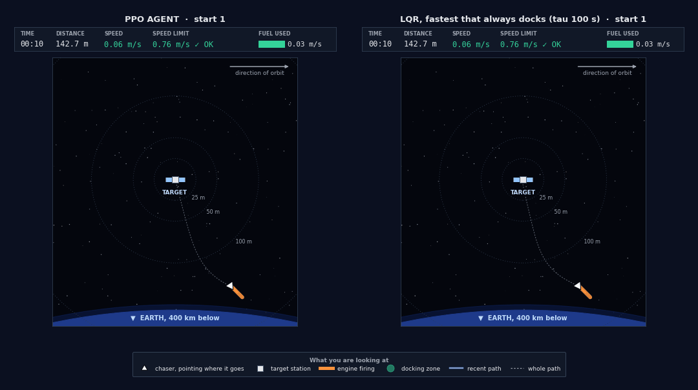

# Orbital Rendezvous

Can a learning agent fly a spacecraft onto a space station by itself? A chaser
in low Earth orbit is flown to a target in the Clohessy-Wiltshire relative
frame, propagated exactly. The project has three parts: reinforcement learning
on the free docking task, the same task through a docking port with a narrow
approach corridor, and a new planner built on what the second part found.
Every method is evaluated on the same 200 starts never seen in training,
against the classical controllers real missions use.



*Part 1: the trained agent (left) and the fastest LQR controller that never
crashes (right), from the same starting point never seen in training.*

**Key results**, on 200 starts never seen in training:

- **Part 1, free docking:** a PPO agent docks **199 of 200** after two minutes
  of training, sooner and on less fuel than the fastest LQR that never crashes
  (600 s and 0.98 m/s against 650 s and 1.05 m/s); asked to save fuel, it gets
  to 0.74 m/s with an engine switch and a Lagrange multiplier.
- **Part 2, through a port:** model-free reinforcement learning stops at a
  median of **118 of 200** after twelve steps of remedies; a network imitating
  a teacher docks 596 of 600, so the limit is finding the manoeuvre, not
  representing it. Go-Explore, searching from saved states and replanning in
  flight, docks **198 of 200** with no teacher and no plan written by hand,
  against 200 for the classical V-bar procedure.
- **Part 3, a graph of exact manoeuvres:** the closed-form transfers between
  points round the station, kept where legal, give every cheapest way in; flown
  node by node by a short-horizon planner, they dock **198 of 200**, 47 of 47
  from behind the station, in 8 ms per decision, and **199 of 200** with a
  10 % error on every thrust.

## Contents

1. [Physics](#physics)
2. [Method](#method)
3. [Baselines](#baselines)
4. [Results](#results)
5. [Discussion and limitations](#discussion-and-limitations)
6. [Getting started](#getting-started)
7. [Repository layout](#repository-layout)
8. [Tests](#tests)
9. [Roadmap](#roadmap)
10. [References](#references)
11. [License](#license)

## Physics

In the frame that travels with a target on a circular orbit, with $`x`$ radial
and $`y`$ along the track, the chaser obeys the Clohessy-Wiltshire equations
[1, 2]:

```math
\ddot{x} - 3n^2 x - 2n\dot{y} = \frac{u_x}{m}, \qquad \ddot{y} + 2n\dot{x} = \frac{u_y}{m}
```

with $`n`$ the mean motion of the orbit. They are linear, so a step with the
thrust held constant is exact, $`\mathbf{s}_{k+1} = \Phi\,\mathbf{s}_k + \Gamma\,\mathbf{u}_k`$,
and the transfer between two points is known in closed form. The Coriolis
terms $`\pm 2n\dot{x}`$, $`2n\dot{y}`$ make the motion counter-intuitive: a
chaser at rest below the station drifts ahead of it, and one moving straight
down the docking axis is pushed sideways. The derivations are in
[Part 1](studies/1_free_docking/README.md#physics), the corridor in
[Part 2](studies/2_oriented_port/README.md#physics).

## Method

| part | task | methods |
| --- | --- | --- |
| [1. Free docking](studies/1_free_docking/README.md) | reach the target from any direction, slowly enough | PPO with a shaped reward; studies of fuel with curricula, a Lagrange multiplier and an engine switch |
| [2. Through a port](studies/2_oriented_port/README.md) | reach the port through a keep-out sphere and a 15° approach cone | PPO and SAC with curricula, a mirror symmetry and a chosen side; imitation of a teacher; a sampling planner with written or learned values; Go-Explore |
| [3. Graph planner](studies/3_graph_planner/README.md) | the same as Part 2 | a graph of exact manoeuvres, its shortest paths, flown node by node by a sampling MPC |

The agents see the state and the clock, and command a continuous thrust of at
most 1 N on a 500 kg chaser, one decision every 10 s.

## Baselines

The comparison is fair by construction: every method flies from the same 200
held-out starts, 80 to 200 m out in every direction, and costs are compared on
the starts each method docks.

- **LQR**, a sweep of time constants from quick to patient (Part 1);
- **the two-impulse transfer**, the textbook reference for fuel (Part 1);
- **the V-bar procedure**, what real missions fly: an LQR to a hold point on
  the docking axis, then down the corridor (Part 2).

## Results

| part | method | docked | $`\Delta v`$ |
| --- | --- | --- | --- |
| 1 | PPO agent | 199 / 200 | 0.98 m/s |
| 1 | fastest LQR that never crashes | 200 / 200 | 1.05 m/s |
| 2 | V-bar procedure | 200 / 200 | 1.06–1.23 m/s |
| 3 | graph pilot, 8 ms per decision | 198 / 200 | 1.87 m/s |
| 3 | graph pilot, 10 % thrust error | 199 / 200 | 1.86 m/s |
| 2 | Go-Explore as a planner, 5 min per flight | 198 / 200 | 1.88 m/s |
| 2 | sampling planner, value written by hand | 195 / 200 | 1.13 m/s |
| 2 | PPO from scratch, median of six seeds | 118 / 200 | — |
| 2 | sampling planner, value learned | 100 / 200 | 1.21 m/s |

## Discussion and limitations

On the free task the agent wins where a quadratic cost cannot express the
constraint, a speed limit at docking, and loses on fuel to the patient
controllers. Through the port model-free trial and error does not find the way
round the station; the methods that do are the ones that search, and the
fastest and most robust computes it, from the exact manoeuvres of the dynamics
(Part 3), matching the classical procedure's reliability with more fuel. The model is planar, linear and deterministic, on
a circular orbit, with no perturbations and no navigation errors. Running a
reinforcement learning agent on Clohessy-Wiltshire dynamics, planning on them,
and Go-Explore are all established; what this project adds is a careful
comparison of them on one task. Each part discusses its own results.

## Getting started

```bash
git clone https://github.com/LoreMonti/Orbital_Rendezvous.git
cd Orbital_Rendezvous
python3 -m venv .venv && source .venv/bin/activate
pip install -e ".[dev]"
```

Python 3.10 or newer; the results were produced with Python 3.10, numpy 2.2.6,
scipy 1.14.1, gymnasium 1.3.0, stable-baselines3 2.9.0 and torch 2.14.0. Each
part lists its scripts and commands in its README; they run from the root.

```bash
python studies/1_free_docking/scripts/train.py                 # train the agent, with the window
python studies/1_free_docking/scripts/evaluate.py              # against LQR and two impulses
python studies/3_graph_planner/scripts/graph_eval.py           # the graph pilot through the port
```

As a library:

```python
from orbital_rendezvous import EnvConfig, RendezvousEnv
from orbital_rendezvous.core.baselines import LQRController

env = RendezvousEnv(EnvConfig(docking_radius=1.0))
lqr = LQRController.from_env(env, approach_time=100.0, fuel_weight=1e-3)
obs, info = env.reset(seed=0)
done = False
while not done:
    obs, reward, terminated, truncated, info = env.step(lqr.act(env.state))
    done = terminated or truncated
print(info["outcome"], info["distance"])
```

## Repository layout

```
Orbital_Rendezvous/
├── README.md, ROADMAP.md, LICENSE, pyproject.toml
├── src/orbital_rendezvous/       # the shared library
│   ├── core/                     # dynamics, environment, reward, baselines, evaluation
│   ├── rl/                       # PPO and SAC training, callbacks, the fuel study
│   ├── planning/                 # the sampling MPC, learned values, Go-Explore, the graph
│   └── viz/                      # the game view and the training window
├── studies/
│   ├── 1_free_docking/           # Part 1: README, configs, scripts, assets
│   ├── 2_oriented_port/          # Part 2: the same, and the teacher-student side study
│   └── 3_graph_planner/          # Part 3: README, scripts, assets
├── tests/                        # core/, rl/, planning/
├── models/, runs/                # trained models and run directories, git-ignored
```

One library serves the three parts, split by function, so that every part
flies the same physics and is evaluated the same way; the parts hold what is
specific to them: a write-up, configurations, scripts and results.

## Tests

```bash
pytest
ruff check .
```

235 tests pin the invariants that would catch a silent error: the dynamics
against the closed form (a sign flip in the Coriolis term or a missing factor
of $`n`$ produces plausible trajectories), every outcome of the environment,
the shaping reward's telescoping sum, the baselines against the Riccati
equation and the exact transfer, the rule of the corridor, the curricula, the
mirror, the planners' scores against what the environment pays, Go-Explore's
dockings replayed from a fresh reset, and the graph's transfers landing on
their nodes. Each part lists the groups behind it.

## Roadmap

How the project was built, step by step and part by part, including the runs
that failed, is in **[ROADMAP.md](ROADMAP.md)**.

## References

1. G. W. Hill, *Researches in the Lunar Theory*, Am. J. Math. **1**, 5 (1878)
2. W. H. Clohessy & R. S. Wiltshire, *Terminal Guidance System for Satellite
   Rendezvous*, J. Aerospace Sci. **27**, 653 (1960)

The full lists, numbered across the parts, are in
[Part 1](studies/1_free_docking/README.md#references) (references 1–10) and
[Part 2](studies/2_oriented_port/README.md#references) (11–14).

## License

MIT License, Lorenzo Monti. See [LICENSE](LICENSE).
