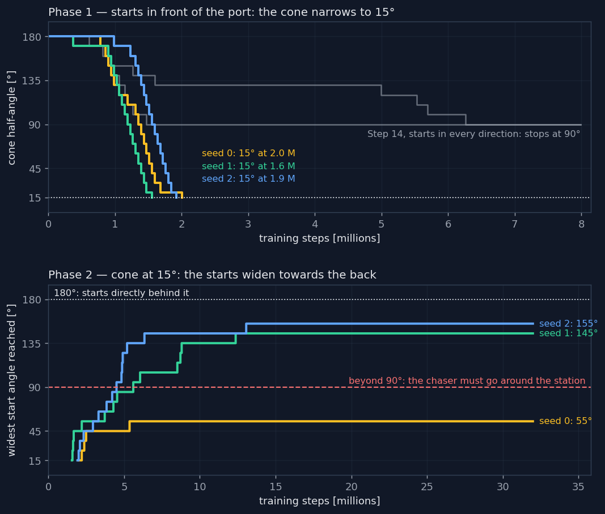
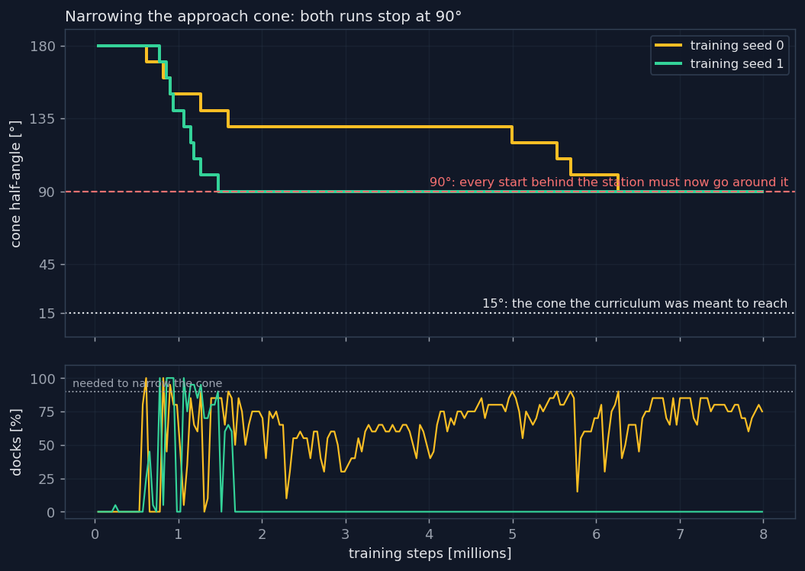

# Part 2 — Docking through a port

Part 2 of [Orbital Rendezvous](../../README.md). A real station is entered
through a docking port: a keep-out sphere surrounds it, crossed only along a
narrow approach cone. The agents of [Part 1](../1_free_docking/README.md),
which arrive from wherever they start, violate it on nearly every attempt.
This part asks whether a learner can discover, with no teacher and no plan
written by hand, how to reach the port from every direction, and measures
every method on the same 200 starts never seen in training, against the
procedure real missions fly.



*Model-free reinforcement learning on the corridor: the approach cone narrowed
first, then the starts widened round the station. Two seeds of three go most
of the way round, none from directly behind.*

**Key results**, on 200 starts never seen in training, in every direction:

- model-free reinforcement learning from scratch, after twelve steps of
  remedies (curricula, SAC, a mirror symmetry, a side chosen by the agent),
  docks a **median 118 of 200** over six seeds, and 1 to 4 of 47 from behind
  the station; a network imitating a teacher docks **596 of 600**, so the
  limit is finding the manoeuvre, not representing it;
- a sampling planner on the known dynamics docks **195 of 200** with a value
  written by hand from the geometry, and **100** when that value is learned
  from its own flights;
- **Go-Explore**, exploring from an archive of saved states and replanning in
  flight, docks **198 of 200**, 46 of 47 from behind the station, with no
  teacher and no value written by hand, at about 5 minutes of computing and
  1.88 m/s per flight; the classical V-bar procedure docks 200 of 200 with
  1.06–1.23 m/s.

## Contents

1. [Physics](#physics)
2. [Method](#method)
3. [Baseline](#baseline)
4. [Results](#results)
5. [Discussion and limitations](#discussion-and-limitations)
6. [Getting started](#getting-started)
7. [Layout](#layout)
8. [Tests](#tests)
9. [Roadmap](#roadmap)
10. [References](#references)

## Physics

### The rule

The port faces the V-bar ($`+y`$). A keep-out sphere of radius
$`R = 20\ \text{m}`$ surrounds the station; inside it, outside the docking
sphere, the chaser must stay within a cone of half-angle $`\theta_c = 15°`$
around the axis. Leaving it is a *keep-out violation* and ends the attempt.
The rule is checked along the whole segment of each step, since a fast chaser
can cross the sphere between two decisions.

### Why the corridor is hard

The approach down the corridor is not straight. Moving along the V-bar at
$`\dot{y}`$, the first Clohessy-Wiltshire equation gives a sideways
acceleration

```math
\ddot{x} = 2\,n\,|\dot{y}|
```

which at $`0.1\ \text{m/s}`$ pushes the chaser
$`\tfrac12\,\ddot{x}\,t^2 \approx 2.5\ \text{m}`$ off the axis in 150 s,
while 5 m from the port the cone is only $`\pm 1.3\ \text{m}`$ wide: holding
the corridor needs a steady sideways thrust. From behind the station the
chaser must first go round the sphere, on one side or the other. A start at a
radial offset $`x_0`$ drifts along the V-bar by

```math
\Delta y = -12\pi\,x_0 \quad \text{per orbit}
```

so far from the axis the natural motion picks a side; near the axis, directly
behind the station, the two ways round cost about the same, and a policy has
to choose.

## Method

Four families of methods, in the order they were tried; the step numbers are
those of the [ROADMAP](../../ROADMAP.md).

### Step 14: the rule imposed gradually

Nothing trained in Part 1 respects the rule: on the 200 unseen starts, the default agent
violates the zone 199 times and the fastest LQR 200 times, since both arrive
from wherever they start. The V-bar procedure docks every time without a
violation:

| V-bar procedure | docked | violations | $`\Delta v`$, median | time, median |
| --- | --- | --- | --- | --- |
| LQR with $`\tau = 100\ \text{s}`$ to the hold point | 200 / 200 | 0 | 1.23 m/s | 1400 s |
| LQR with $`\tau = 200\ \text{s}`$ to the hold point | 200 / 200 | 0 | 1.06 m/s | 1775 s |

Teaching the agent the rule took five attempts, each on at least two seeds.

| attempt | what happened |
| --- | --- |
| the rule enforced from the start | the agent stops approaching: nearly every early approach comes in from the wrong side and ends in a violation |
| a potential pulling towards the mouth of the cone, at 15° from the start | the agent never learns to dock, even with violations free |
| a Lagrange multiplier on violations, rising fast | docking is learned, then collapses as soon as the price rises |
| the same, rising slowly and relaxing when docking is lost | docking collapses all the same, and never comes back |
| **a curriculum narrowing the cone from 180°** | the cone narrows to **90°**, then stops |

The curriculum starts with a cone of 180°, which is no constraint at all, and
narrows it by 10° whenever the deterministic agent docks in 90 % of its
attempts under the strict rule. With it, the shaping potential measures the
shortest path to the mouth of the *current* cone around the sphere, a tangent,
an arc of its rim and the axis,

```math
d = \sqrt{r^2 - R^2} + R\,\Delta\varphi + R
```

equal to the straight distance at 180° and changing only as the cone narrows,
so that the potential and the constraint change together.



Both runs stop at 90°, one after 1.5 million steps, where it then stops docking
altogether, and one after 6.4 million, where it docks 70 to 85 % of the time
but never the 90 % needed to go further. With the straight potential instead,
two earlier runs stopped at the same angle. At 90° the rule becomes *arrive
from the front half*, and every start behind the station must go around it.
Down to that point, the agent learned to shift its direction of arrival a
little at a time; going around the station is not a small shift but a
different manoeuvre, and PPO does not find it in these small steps. On the
full corridor the V-bar procedure, a few lines written by someone who knows the
physics, wins. The next section takes the small steps in the starting points
instead, and gets further.


### Step 15: two curricula

The cone curriculum changed the rule for every start at once. The next attempt kept the
rule and changed the starts instead, a *reverse curriculum* [11]: first only
starts at most $`15°`$ from the docking axis, then wider by $`10°`$ each time
the agent docks in 90 % of 20 test attempts from the outer $`30°`$ of the
current range. The test uses the outer band only: at $`180°`$ the newest
$`10°`$ are 6 % of the starts, and a threshold over all of them could be
passed while failing every new one. Training starts are still drawn over the
whole range, so the easy ones are not forgotten.

On its own, from scratch, this never docked, not once in 27 000 episodes per
seed on two seeds, not even from in front of the port. Starting inside the cone
does not make the straight approach easy, because the approach is not straight.
Moving along the V-bar at $`\dot{y}`$, the first Clohessy-Wiltshire equation
gives a sideways acceleration

```math
\ddot{x} = 2\,n\,|\dot{y}|
```

which at $`0.1\ \text{m/s}`$ is $`2.3 \times 10^{-4}\ \text{m/s}^2`$: in 150 s,
uncorrected, $`\tfrac12\,\ddot{x}\,t^2 \approx 2.5\ \text{m}`$, while 5 m from
the port the cone is only $`\pm 1.3\ \text{m}`$ wide. Even the default agent,
which docks from anywhere without the rule, fails 100 times in 100 from these
starts with a cone of 15°, and 17 times with a cone of 60°. A policy that cannot
dock yet never sees a docking, while coming close costs $`-100`$ and staying out
costs nothing, so it stays out.

The two curricula were therefore put in sequence, each where it had worked:

1. **Phase 1**: starts at most $`15°`$ from the axis, and the cone narrowed from
   $`180°`$, no constraint, to $`15°`$, as in Step 14. The agent first learns
   to dock, then to hold the axis against the Coriolis term.
2. **Phase 2**: the cone at $`15°`$, and the starts widened, as above.

Each run trained for 32 million steps, about 100 minutes, three seeds in
parallel:


Phase 1 reaches $`15°`$ on every seed, in 1.6 to 2.0 million steps, where
Step 14, with starts in every direction, stopped at $`90°`$. Holding the corridor
is learned. Phase 2 goes around the station on two seeds out of three, to
$`145°`$ and $`155°`$, and stops at $`55°`$ on the third. No seed reaches
$`180°`$, and none moves after 13 million steps: doubling the training from
16 to 32 million steps did not move the curriculum on the two seeds run both
ways. On the
200 unseen starts in every direction:

| | docked | violations | from $`0\text{–}90°`$ | from $`90\text{–}135°`$ | from $`135\text{–}180°`$ |
| --- | --- | --- | --- | --- | --- |
| V-bar procedure | 200 / 200 | 0 | 97 / 97 | 56 / 56 | 47 / 47 |
| seed 0, stopped at $`55°`$ | 71 / 200 | 128 | 64 / 97 | 6 / 56 | 1 / 47 |
| seed 1, reached $`145°`$ | **153 / 200** | 47 | 97 / 97 | 51 / 56 | 5 / 47 |
| seed 2, reached $`155°`$ | 121 / 200 | 79 | 87 / 97 | 30 / 56 | 4 / 47 |

Seed 2 reached $`155°`$ at 13 million steps, then lost it: by the end it
docked in only 25 % of its test attempts from the outer band, and the start
angle, which never narrows, overstates it.

An agent that docks only from some starts would look cheap or fast next to a
procedure that also flies the hard ones, so the costs are compared on the very
starts each agent docks:

| on the starts it docks | agent | V-bar, $`\tau = 100\ \text{s}`$ | V-bar, $`\tau = 200\ \text{s}`$ |
| --- | --- | --- | --- |
| seed 0, 71 starts | 1.12 m/s, 860 s | 1.00 m/s, 1300 s | 0.87 m/s, 1660 s |
| seed 1, 153 starts | 1.45 m/s, 980 s | 1.14 m/s, 1340 s | 0.98 m/s, 1730 s |
| seed 2, 121 starts | 0.75 m/s, 1890 s | 1.08 m/s, 1320 s | 0.92 m/s, 1700 s |

The seeds found different trades. Seeds 0 and 1 are faster than the procedure
on every start they dock, by about 400 s in the median, and spend more fuel. Seed 2 is
cheaper on every one, by about 20 % against the slower procedure, and 190 s
slower. None is both, and none is as reliable.

### Steps 16–20: a side study, learning from a teacher

Set aside in [`teacher_student`](teacher_student): the
corridor flown by learned pilots on the V-bar procedure's plan, then distilled
by imitation into one network. It shows that a network can dock through the
port, not that reinforcement learning can discover how, the question this
project pursues.

| approach | how the corridor is learned | docked |
| --- | --- | --- |
| single agent (Step 15) | reinforcement learning from scratch | 153 / 200 |
| two pilots on the V-bar plan | RL on fixed sub-tasks, plan written by hand | 200 / 200 |
| one network distilled from them | imitation of that system | 596 / 600, three seeds |


### Steps 21–25: reverse curriculum, mirror, side

Back to reinforcement learning from scratch after the side study, a reverse
curriculum [11] (starts next to the port first, then further out and round)
stopped at $`45°`$ on every seed. Two changes to the reward, a failure
penalty graded by how close it came and a discount of 0.995, did not move it.
Split by side, the wall was one-sided: from $`x \lt 0`$ the agents docked
81–99 of 100, from $`x \gt 0`$ 5–23, and the same network flown as in a
mirror docked 161–172 of 194 from $`x \gt 0`$. PPO had learned the approach
on one side only.

- **Mirror** (`mirror_symmetry`): a start outside the sphere with
  $`x \gt 0`$ is shown to the agent as on the other side, $`x`$,
  $`\dot{x}`$ and $`u_x`$ flipped for the whole episode. The wall at
  $`45°`$ went on every seed; on the 200 starts the best seed docked 152.
- **Side chosen by the agent** (`side_choice`): a last action component, read
  once, chooses the mirror, so that two good ways round are not averaged into
  a bad one. One seed reached the whole task, 163 of 200; six seeds put it in
  context, median 118.
- **Brakes on PPO** (a decaying learning rate, a KL target): slower, and no
  better.

### Step 26: planning with the known dynamics

A sampling planner (the cross-entropy method on the closed-form dynamics)
scores thrust sequences over a horizon $`H`$ with the environment's own
rewards, plus a value beyond the horizon:

```math
\mathbf{a}_t = \arg\max_{\mathbf{a}_{t:t+H}} \sum_{k=0}^{H-1} \gamma^k\, r(\mathbf{s}_{t+k}, \mathbf{a}_{t+k}) + \gamma^H\, V(\mathbf{s}_{t+H})
```

Blind beyond its horizon it never docks; with the shaping potential as
$`V`$, which measures the way round the sphere, it docks 195 of 200. Learned
from its own flights in five forms, $`V`$ did no better than the bare
distance, 100 of 200: a plateau of value short of the port where the planner
hovered, values invented beyond the data, a zone without the network that
followed a distance instead of what the search could see.

### Step 27: Go-Explore

Go-Explore [12] separates finding the way from learning it. Phase 1 keeps an
archive of *cells*, the states reached so far grouped by position and speed,
returns to one of them by restoring the simulator's state, and explores from
it with random thrusts; the cell to return to is drawn with weight
$`w = e^{-r/30\ \text{m}} / \sqrt{n+1}`$, near the port and seldom chosen,
and cells shrink to 0.5 m next to the port. On 400 starts in every direction
it found a docking from 393, 94 of 95 from behind the station, each docking
again when its thrusts were replayed. Turning those trajectories into a
network failed by imitation (2 of 200) and was slow by the backward
algorithm. Used as a planner instead, exploring again from the chaser's state
every 30 steps, it docks 198 of 200.

## Baseline

### The V-bar procedure

The reference is the procedure real missions fly. An LQR brings the chaser to a hold point on
the V-bar, 30 m out, first via a waypoint beside the keep-out sphere if the
direct way would cross it. The chaser then tracks a reference sliding down the
axis at $`v_c = 4\ \text{cm/s}`$ to the port. Staying on the axis while moving
along it needs a steady radial thrust against the Coriolis term: with $`x = 0`$
and $`\dot{y} = -v_c`$ the first Clohessy-Wiltshire equation gives

```math
u_x = 2\,n\,v_c\,m
```


Every method is flown from the same 200 starts never seen in training, in
every direction from 80 to 200 m, with the rule in force; dockings are
counted by the direction the start came from, and costs are compared on the
starts each method docks.

## Results

On the 200 unseen starts:

| method | how it knows the way | docked | from behind (135–180°) | $`\Delta v`$ |
| --- | --- | --- | --- | --- |
| V-bar procedure | written by hand | **200** | 47 / 47 | 1.06–1.23 m/s |
| Go-Explore as a planner (Step 27) | search from saved states | **198** | 46 / 47 | 1.88 m/s |
| planner, value written by hand (Step 26) | search + geometry by hand | 195 | 45 / 47 | 1.13 m/s |
| one network distilled from a teacher (Step 20) | imitation of a hand plan | 596 / 600 | — | 0.92 m/s |
| RL with a side choice, best seed (Step 24) | trial and error | 163 | 20 / 47 | 2.22 m/s |
| RL, median of six seeds (Step 24) | trial and error | 118 | 1–4 / 47 | — |
| planner, value learned (Step 26) | search + learned value | 100 | 15 / 47 | 1.21 m/s |
| Go-Explore phase 2, backward algorithm (Step 27) | RL from found trajectories | 73 | 0 / 47 | — |

With an error of 10 % in magnitude and 3° in direction on every thrust, the
plan Go-Explore finds at the start, flown without replanning, docks 9 of 200:
a fixed sequence does not survive imperfect thrust.

## Discussion and limitations

**What the corridor needed.** Every model-free remedy removed an obstacle,
the wall at $`45°`$, the side the agent learned, the averaging of two ways
round, and none moved the typical result. The network was never the limit:
given good trajectories it flies them. What was missing was finding them,
and the methods that worked are the ones that search: a planner with a good
value, or an exploration that returns to where it has been.

**Where it is not a learned policy.** Go-Explore as a planner is a search,
repeated in flight: minutes per flight and 60 % more fuel than the procedure,
and nothing is left in a network. Turning what it finds into a policy is the
open half of this part.

**What is left out.** No thrust or navigation errors in the main results;
the one test with thrust errors was open loop. A planar, deterministic model
on a circular orbit, as in Part 1.

**Where it is not novel.** Planning on CWH dynamics is an established field
[13], and so are a learned value at the end of an MPC horizon [14] and
Go-Explore [12]; the contribution is the comparison, on one task and one set
of starts, of every family of method. Part 3 builds on this.

## Getting started

Install as in [Part 1](../1_free_docking/README.md#installation). Run the
scripts from the root of the repository; each lists its options with `--help`.
Agents are trained with Part 1's `train.py` and a configuration of this part.

| script | what it does |
| --- | --- |
| `corridor_eval.py` | agents on the oriented target against the V-bar procedure, on the 200 unseen starts: dockings by direction, costs on the same starts |
| `cone_summary.py`, `curriculum_summary.py` | the curricula of Steps 14–15 during training, from saved results |
| `plan_eval.py` | the sampling planner of Step 26, one row per value and horizon |
| `value_loop.py` | learns the planner's value from its own flights; resumable |
| `go_explore.py` | Go-Explore phase 1 on many starts, in parallel; resumable |
| `go_explore_eval.py` | Go-Explore as a planner, replanning or open loop, with optional thrust errors |

```bash
caffeinate -ims python studies/1_free_docking/scripts/train.py --no-render \
    --config studies/2_oriented_port/configs/ppo_corridor_side.yaml --output models/side_seed1.zip
python studies/2_oriented_port/scripts/corridor_eval.py \
    --config studies/2_oriented_port/configs/ppo_corridor_side.yaml --models models/side_seed1.zip
python studies/2_oriented_port/scripts/plan_eval.py --settings potential:20:4
python studies/2_oriented_port/scripts/go_explore.py --run runs/go_explore --starts 400
python studies/2_oriented_port/scripts/go_explore_eval.py --replan-every 30
```

## Layout

```
studies/2_oriented_port/
├── README.md                     # this write-up
├── configs/                      # the corridor (Steps 14–15) and its variants (Steps 21–25)
├── scripts/                      # evaluations, planners, Go-Explore, summaries
├── assets/                       # plots and the evaluation numbers of every step
└── teacher_student/              # Steps 16–20, with its own package, scripts, tests and README
```

The features of the rule (the sphere, the cone, the mirror, the side choice)
are options of the shared environment, off by default, so that Part 1 runs
unchanged; the planners and Go-Explore are in `src/orbital_rendezvous/planning`.

## Tests

```bash
pytest tests studies/2_oriented_port/teacher_student/tests
```

The groups behind this part; the side study has its own in its README.

- **Oriented target.** A violation is caught inside the sphere and outside the
  cone, even when a fast step crosses the sphere with both ends outside it;
  the docking sphere is exempt; a cone of 180° is no constraint; the path
  around the sphere matches $`\sqrt{r^2 - R^2} + R\,\Delta\varphi + R`$ and is
  continuous across the edge of the cone; the V-bar procedure docks with no
  violation; the price of a violation waits for docking and relaxes when
  docking is lost; the cone narrows only once mastered, never below its final
  angle.
- **Curriculum on starts.** With every direction allowed, a seed selects
  exactly the start it selected before the option existed, redrawn with
  gymnasium's generator, so every earlier model and number still holds; a
  narrower range keeps every start inside it, on both sides of the axis; the
  starts widen only once mastered, mastery is tested on the outer band, and
  the second curriculum waits for the first to finish; the Coriolis term
  pushes a chaser coasting down the V-bar out of the cone, while the thrust
  $`2\,n\,v_c\,m`$ keeps it in and docks it, which is the reason phase 1
  exists; dockings are counted by the direction the attempt started from, not
  where it was after one step; and the corridor configuration trains with
  phase 1 under way from the first episode, while saving the full task and the
  seed actually used.
- **Reverse curriculum.** Every earlier start is unchanged, seed for seed,
  and far from the station so is every start velocity; inside the keep-out
  sphere a start lies in the approach cone, and close to the port its random
  velocity shrinks with the distance; each stage keeps to its distances and
  angle, advances only once mastered, is tested on its outer band and can
  draw part of its starts from its newest part; the approach cone can open
  first on the first stage; a timeout can be made a failure; the shaping
  path can keep a margin from the rim, while the straight way stays inside the
  cone; and SAC trains on the same task and is loaded back as SAC.
- **Mirror.** Off, nothing changes; on, every start outside the keep-out
  sphere is shown on the side $`x \le 0`$, with $`x`$ and $`\dot{x}`$ flipped
  only on the mirrored side; the radial thrust is flipped back, so a command
  towards the axis pushes the chaser towards the axis on both sides; two
  mirrored starts look the same to the agent; the side is kept when the
  chaser crosses the axis; and inside the sphere observations and rewards
  equal those without the mirror bit for bit, seed for seed and action for
  action, so the first stages of a curriculum train exactly as before. With
  the side chosen by the agent, the choice is read on the first step only and
  kept, there is none inside the sphere, and choosing by the sign of $`x`$
  reproduces the fixed mirror bit for bit.
- **Brakes on PPO.** Off, no setting changes; on, the learning rate falls from
  its start to its end, in that order, and the KL target reaches the model.
- **Planner.** Its score equals what the environment pays, step by step, for
  sequences ending in a violation, a docking, a crash and an escape; the
  value counts only beyond the horizon, discounted, and never after the last
  step of an episode; without the port it docks within the thrust limit.
- **Learned value.** The returns it is fitted to, checked by hand; an untrained
  network leaves the prior unchanged; the fit reproduces a known function;
  the network is off down the cone near the port and on beside the sphere;
  a penalty-only correction never raises the prior; disagreeing networks
  lower the value; the planner values the state reached after its horizon.
- **Go-Explore.** Cells group nearby states, split speeds and shrink next to
  the port; the search returns more often to cells near the port and seldom
  chosen; a docking found by restoring saved states docks again when its
  thrusts are replayed from a fresh reset, with no violation; an exploration
  can start anywhere in an episode; the planner docks and replans on schedule.

## Roadmap

Steps 14 to 27, each with what was tried, the numbers and a *Lesson*, failed
runs included, are in **[ROADMAP.md](../../ROADMAP.md)**.

## References

The numbering continues that of [Part 1](../1_free_docking/README.md#references).

11. C. Florensa, D. Held, M. Wulfmeier, M. Zhang & P. Abbeel, *Reverse
    Curriculum Generation for Reinforcement Learning*, Proc. CoRL (2017)
12. A. Ecoffet, J. Huizinga, J. Lehman, K. O. Stanley & J. Clune, *First
    return, then explore*, Nature **590**, 580 (2021)
13. J. A. Starek, E. Schmerling, G. D. Maher, B. W. Barbee & M. Pavone, *Fast,
    Safe, Propellant-Efficient Spacecraft Motion Planning Under
    Clohessy–Wiltshire–Hill Dynamics*, J. Guid. Control Dyn. **40**, 418 (2017)
14. K. Lowrey, A. Rajeswaran, S. Kakade, E. Todorov & I. Mordatch, *Plan
    Online, Learn Offline: Efficient Learning and Exploration via Model-Based
    Control*, Proc. ICLR (2019)

## License

MIT, Lorenzo Monti; see [LICENSE](../../LICENSE).
