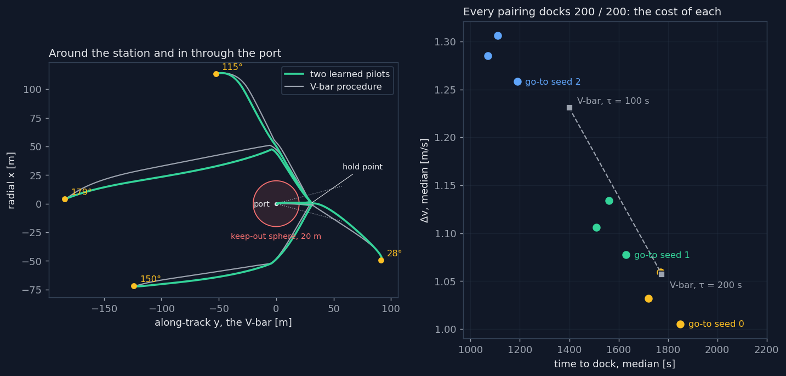

# Learning from a teacher: a side study, set aside

Steps 16 to 20 of [Orbital Rendezvous](../../../README.md), in [Part 2](../README.md), kept here with their
code, configurations, tests and results. The main project asks whether
reinforcement learning can discover, alone, how to dock through an oriented
port; after a single agent reached 153 dockings in 200 (Step 15), this study
took another road: learned pilots flying the plan of the classical V-bar
procedure, a learned choice of waypoint, and the whole system distilled by
imitation into one network, which docks 596 times in 600. It answers a
different question, whether a network can fly the corridor, and is set aside
so that the main line can return to the first one.

The physics, the environment, the corridor and the baselines are those of the
main README; step numbers refer to its ROADMAP.

| approach | docked | $`\Delta v`$ | time |
| --- | --- | --- | --- |
| V-bar procedure, two tunings | 200 / 200 | 1.06–1.23 m/s | 1400–1775 s |
| two learned pilots, nine pairings of seeds | 200 / 200 each | 1.01–1.31 m/s | 1070–1850 s |
| pilots with a planner taught by the oracle | 200 / 200 | 0.93 m/s | 1715 s |
| one network distilled from them, three seeds | 199, 197, 200 | 0.92 m/s | 1690–1720 s |

## Two learned pilots on the classical plan

Before choosing a remedy, one more measurement: *how* the Step 15 agents fail
from behind. From starts 160–180° from the axis, both of the better seeds
failed 18 times out of 18, the best one by flying straight into the back of the
keep-out sphere, at a median of 172°; when they did go around, it was always on
the side they started from. The optimal action
behind the station jumps between going around on one side and on the other,

```math
a^*(\varphi) = \begin{cases} a_\text{one side}, & \varphi \lt 180° \\ a_\text{other side}, & \varphi \gt 180° \end{cases}
```

while a network with $`\tanh`$ units is a continuous function of the state, so
in some band around $`180°`$ it must pass through the average of the two,
straight ahead. A diagnostic run with starts on one side only, so that no jump
is needed, went further, to $`175°`$, but then lost that stage, and of four
such runs two never docked at all and one learned and collapsed. The choice of
side was a real obstacle but not the main one: the main one was that the
agent did not keep what it learned, on a task that kept changing under it.

The remedy keeps the plan of the V-bar procedure, and learns only the flying:

1. the procedure's planner puts a waypoint beside the keep-out sphere, 50 m
   out on the radial axis on the side of the start, if the straight way to the
   hold point would cross the sphere;
2. a **go-to pilot** flies to that waypoint, passing it without stopping, then
   to the hold point 30 m out on the docking axis, where it stops;
3. a **final-approach pilot** takes over there and flies down the corridor.

The go-to pilot learns the task of the default agent with the target moved to
a goal $`\mathbf{g}`$: the same potential, with distances measured from
$`\mathbf{g}`$, and success within 2 m of it, slower than 4 cm/s, which are also
the handover thresholds. A shift of the target is not a symmetry of the
dynamics: at rest at $`x`$ the chaser needs a steady thrust

```math
u_x = -3\,n^2\,x\,m
```

to stay, 0.1 N at the waypoint and none on the V-bar, so the pilot observes its
position both relative to the goal and in absolute terms,
$`[(\mathbf{p}-\mathbf{g})/r_\mathrm{max},\ \mathbf{v}/v_\mathrm{ref},\ \mathbf{g}/r_\mathrm{max},\ t/T_\mathrm{max}]`$.
Goals are the planner's three points, each moved at random by up to 5 m, and a
third of the starts are set up as a handover at a waypoint: near one, already
moving at up to 0.3 m/s. The final-approach pilot starts 25–35 m out within
$`5°`$ of the axis, with the full rule, and the cone curriculum of phase 1.

Three things keep what is learned: each pilot learns one task that never
changes, apart from the cone; the policy kept is the best one on 50
validation starts, seeds apart from both the training and the test starts,
not the last one; and once chosen, a pilot is frozen. The choice of side is
the planner's, so neither network has to jump. Configurations
`configs/ppo_goto.yaml` and `configs/ppo_final_approach.yaml`, three seeds
each, about 20 minutes for all six in parallel.

Each pilot reached 100 % on its validation starts on every seed, the go-to
pilot within 0.6 million steps, the final-approach pilot within 1.3–3.4
million, and kept it; one final-approach run later dipped to 94 %, where the
best model it had saved stayed at 100 %. On the 200 unseen starts, with every
pairing of the three go-to and the three final-approach pilots:

| | docked | violations | from $`135\text{–}180°`$ | $`\Delta v`$, median | time, median |
| --- | --- | --- | --- | --- | --- |
| V-bar procedure, $`\tau = 100\ \text{s}`$ | 200 / 200 | 0 | 47 / 47 | 1.23 m/s | 1400 s |
| V-bar procedure, $`\tau = 200\ \text{s}`$ | 200 / 200 | 0 | 47 / 47 | 1.06 m/s | 1775 s |
| **pilots, 9 pairings of seeds** | **200 / 200 each** | **0** | **47 / 47 each** | 1.01–1.31 m/s | 1070–1850 s |
| best single agent of Step 15 | 153 / 200 | 47 | 5 / 47 | 1.45 m/s | 980 s |



*Left: the same four held-out starts flown by the pilots (green) and by the
V-bar procedure (grey), from behind the station included. Right: the median
cost of each of the nine pairings of pilots, coloured by the seed of the go-to
pilot, against the two tunings of the procedure.*

Every pairing docks from every start: 1800 attempts, 1800 dockings, no
violation. On cost the pilots and the procedure are close, and the leg by leg
split shows where they differ:

| median over the 200 starts | to the hold point | down the corridor |
| --- | --- | --- |
| V-bar procedure, $`\tau = 100\ \text{s}`$ | 1.12 m/s, 680 s | 0.10 m/s, 720 s |
| V-bar procedure, $`\tau = 200\ \text{s}`$ | 0.95 m/s, 1055 s | 0.10 m/s, 720 s |
| go-to seed 0 | 0.85 m/s, 1290 s | |
| go-to seed 1 | 0.92 m/s, 1080 s | |
| go-to seed 2 | 1.10 m/s, 650 s | |
| final-approach seeds 0–2 | | 0.15–0.21 m/s, 420–550 s |

To the hold point, where most of the fuel goes, each go-to seed found a
different point on much the same trade-off as the procedure's LQR, a few
percent better at equal time at most. Down the corridor the learned pilot is
170 to 300 s faster and spends 0.05 to 0.1 m/s more. Seeds of the go-to pilot
differ far more than seeds of the final approach, so the choice of go-to
pilot sets the cost of the whole approach.

## A learned planner

The pilots made the approach reliable by leaving the plan to a rule. The way
back to a fully learned system takes the plan back one decision at a time,
checking at each step that the approach stays reliable, so that a failure
points to the decision that caused it. The first decision is the rule's own:
where to put the waypoint, if any.

The choice of side jumps at $`180°`$, and it would jump for a planner too, if
it output the waypoint as a continuous angle. The planner therefore chooses
from a **menu**, 16 directions around the station at 40 and 60 m plus
straight to the hold point, 33 choices, with a categorical policy

```math
\pi(k \mid \mathbf{s}_0) = \frac{e^{f_k(\mathbf{s}_0)}}{\sum_j e^{f_j(\mathbf{s}_0)}},
\qquad k^* = \arg\max_k f_k(\mathbf{s}_0)
```

Each score $`f_k`$ is a smooth function of the start, but the choice $`k^*`$
jumps where two scores cross: a discrete choice can make the jump that a
continuous output cannot.

The planner takes one decision per approach, from the start state
$`\mathbf{s}_0`$; the frozen pilots then fly the whole approach, and the
planner is paid at the end,

```math
R(k;\ \mathbf{s}_0) = 100\cdot\mathbb{1}[\text{docked}] - 100\cdot\mathbb{1}[\text{not docked}] - w_f\,\Delta v
```

a timeout counting as a failure, so that it cannot win by waiting. It is a
contextual bandit, one step per episode, trained with PPO on 60 000
approaches. The go-to pilot was retrained with the whole menu among its goals,
and still reaches 100 % on validation on three seeds of three, within 0.5
million steps; seed 0, fixed as the planner's pilot before any test, still
docks 200 times in 200 with the rule's plan.

Before training the planner, an **oracle** measured the room there is: from
each of the 200 test starts it flies all 33 choices and keeps the best, docking
first, then the least $`\Delta v`$. No planner choosing from this menu, with
these pilots, can do better. It beats the rule by 3 % of fuel and no more:
0.90 against 0.93 m/s, with the go-to pilot of seed 0. Where the rule goes
around the station, the oracle goes around the other side on 9 starts in 71,
the asymmetry of the Coriolis term, worth little.

The first planner, with $`w_f = 10`$, docked every time and settled on two
choices of the 33, spending 8 to 15 % more than the rule. Between a good choice
and a safe but mediocre one lie about 0.17 m/s, which at $`w_f = 10`$ is worth
1.7 points of reward, against 200 between docking and failing: once two
choices never failed, the gradient left to refine them was lost in the noise.
With $`w_f = 50`$ the same difference is worth 8.5 points, and on three seeds:

| planner, same pilots | docked | violations | $`\Delta v`$, median | time, median |
| --- | --- | --- | --- | --- |
| rule of the V-bar procedure | 200 / 200 | 0 | 0.93 m/s | 1760 s |
| learned, $`w_f = 10`$ (two seeds) | 200 / 200 | 0 | 1.00–1.07 m/s | 2310 s |
| **learned, $`w_f = 50`$ (three seeds)** | **200 / 200** | **0** | **0.91–0.92 m/s** | 2160–2180 s |
| oracle, best of the menu | 200 / 200 | 0 | 0.90 m/s | 2090 s |

Each learned planner docks from every start, uses five or six choices of the
menu, goes around on the rule's side on 66 starts of 71 and on the other side
on the rest, and spends within 0.02 m/s of the oracle: it took nearly all the
room the rule left. It is 400 s slower, as the oracle is, because the reward
counts fuel and not time. It never flies straight to the hold point, but
through a point 60 m out on the docking axis instead, which amounts to the
same.

## Learning the planner from the oracle

The learned planner had one visible flaw: in front of the port, where the rule
flies straight to the hold point, it went through a point 60 m out on the axis
instead, almost free in fuel but ten minutes longer. Its reward did not count
time. The cost of an approach became

```math
J = w_f\,\Delta v + w_t\,T, \qquad w_f = 50\ \text{per m/s}, \quad w_t = 0.01\ \text{per s}
```

so that the ten-minute detour costs 5.8, as 0.12 m/s would. With time counted,
the oracle flies straight to the hold point from 151 starts of 200, and beats
the rule by about 1 % of $`J`$: 63.6 against 64.4.

A second change aimed at the noise of the reward. The cost of an approach
depends mostly on its start, a few tenths of a m/s between a near and a far
one, against a few hundredths between choices from the same start. The rule
was therefore flown from the same start too, and the planner rewarded for
$`J_\text{rule} - J`$, the cost saved against it, in which the start cancels.
On two seeds this did not help: one planner docked 199 times in 200, the other
200, at $`J`$ of 68.8 and 66.4, both worse than the rule. The validation
curves showed why. Each planner committed to a few choices within the first
13 000 approaches and never tried the others again: early on only docking
matters, and a policy that has become nearly deterministic on the safe
choices no longer explores. The noise was real, but exploration was the
obstacle.

A bandit sees one choice per approach, the one it tried; a simulator can fly
them all. The planner was then **taught the oracle's ranking** instead: for
4000 training starts, seeds apart from both validation and test, every choice
was flown and its cost recorded, about 20 minutes on four processes, and the
same network was fitted to soft targets

```math
p_k = \frac{e^{-(J_k - J_\text{min})/T}}{\sum_j e^{-(J_j - J_\text{min})/T}}, \qquad p_k = 0 \text{ if choice } k \text{ does not dock}
```

with $`T = 1`$, so that near-ties share the target rather than one being
picked by noise. This is supervised learning from a search, not reinforcement
learning, and it reproduced the oracle's choices, straight ahead on 152
starts, but docked only 197 times in 200. The three failures were all behind
the station, and all the same: the cheapest choice that docks is often the one
that passes closest to the keep-out sphere, the planner learned to cut that
corner, and near the edge a small error is a violation. In each case a choice
a little wider, which docks, was its second.

The fix prices a failure into the fit, as the bandit's reward does. The loss
charges the expected cost of the policy's choice,

```math
\mathcal{L} = -\sum_k p_k \log \pi_k + \lambda \sum_k \pi_k\,\frac{J_k + C\,\mathbb{1}[k \text{ fails}]}{C}, \qquad C = 200
```

so that probability on a choice that fails costs far more than a little fuel
saves, and near the edge the planner learns to keep a margin:

| planner, same pilots, cost $`J`$ | docked | violations | time, median | $`J`$, median | straight to the hold point |
| --- | --- | --- | --- | --- | --- |
| rule of the V-bar procedure | 200 / 200 | 0 | 1760 s | 64.4 | — |
| PPO, fuel only ($`w_f = 50`$) | 200 / 200 | 0 | 2170 s | 67.4 | 0 |
| PPO, time and the rule as baseline | 199–200 / 200 | 0–1 | 2075–2150 s | 66.4–68.8 | 0–44 |
| oracle's ranking, $`\lambda = 0`$ | 197 / 200 | 3 | 1700 s | 63.3 | 152 |
| $`\lambda = 1`$ | 198 / 200 | 2 | 1710 s | 63.4 | 151 |
| $`\lambda = 5`$ | 199 / 200 | 1 | 1710 s | 63.6 | 150 |
| **$`\lambda = 20`$, three seeds** | **200 / 200** | **0** | **1715 s** | **63.6** | 149 |
| oracle, best of the menu | 200 / 200 | 0 | 1710 s | 63.6 | 151 |

With $`\lambda = 20`$ the planner docks every time, flies straight ahead
wherever that is safe, and matches the oracle's cost: the best any choice from
this menu, with these pilots, could do, 1 % and 45 s better than the rule. The
three seeds give identical results, since the seed only changes the network's
initial weights and the split of the labels, not the labels themselves. The
margin over the rule is small because the rule is nearly optimal; what the
planner shows is that the decision can be learned, and learned to the best
possible, once it is taught from every choice rather than from the one it
happened to try.

## More waypoints?

The next decision to take back from the plan was how many waypoints to fly:
at each arrival, another waypoint from the menu or on to the hold point. The
value of a choice would then include the choices after it,

```math
Q(\mathbf{s}_i, k) = c(\mathbf{s}_i, k) + \min_{k'} Q(\mathbf{s}_{i+1}, k')
```

with $`c`$ the cost of the leg to waypoint $`k`$ and $`\mathbf{s}_{i+1}`$ the
state on arrival: a sequence of options [1] rather than a single choice.
Before building it, a beam search measured what more waypoints could win. From
each of the 200 test starts it flew every plan with no waypoint or one, then
extended the three cheapest that docked by every other waypoint, twice: 219
flights per start instead of $`33^3 \approx 36\,000`$.

| best plan with at most | docked | $`J`$, median | plans with 0 / 1 / 2 / 3 waypoints |
| --- | --- | --- | --- |
| one waypoint | 200 / 200 | 63.59 | 151 / 49 / — / — |
| two waypoints | 200 / 200 | 63.59 | 151 / 49 / 0 / — |
| three waypoints | 200 / 200 | 63.59 | 151 / 49 / 0 / 0 |

On no start does a second or third waypoint lower the cost, not even from
behind the station. With a single keep-out sphere and a single corridor, one
point beside the sphere is all a way around needs, which is also why the
V-bar procedure holds at one point only. A planner that learned how many
waypoints to fly would learn a constant, always to stop, so Step 18 ends with
the measurement and was not built. The beam can miss a plan whose first
waypoint is not among its three best, so the result is a strong indication
rather than a proof.

## One network again: distillation

Two steps back towards a fully learned system had each taken one decision
from the plan. What was left, the menu, the sequence waypoint, hold point,
corridor, and the thresholds of the handover, went all at once: the whole
system of Step 17c became a teacher, and a single network, the **student**,
learned to fly as it does [2]. The student has the observation and the
action of the default agent, five numbers in and two thrusts out, and nothing
hand-written around it.

The teacher flew 4000 training starts three times: without noise, with
Gaussian noise of 0.02 of full thrust on the thrust it applied, and with noise
of 0.1 beyond 40 m from the station. The labels are always the teacher's own
commands, so the noisy flights show states off the teacher's path together
with the way back to it, which a student that errs a little will need [3].
Near the port the corridor leaves no room for noise: with 0.05 everywhere the
teacher itself failed one flight in four, and the data would have lacked the
last metres, hence the radius. Of the 12 000 flights, 11 829 docked, about
2.2 million steps in all.

A student that simply regressed the teacher's thrust would meet the old
obstacle behind the station, where the teacher goes around one side or the
other and a continuous fit would average them into flying straight at it. The
student therefore has **two heads** on a shared trunk of 256 × 256 units: a
mode head choosing among three, straight to the hold point or around on the
$`+x`$ or $`-x`$ side, once at the start and kept for the whole approach, and
a thrust head that sees the mode:

```math
\mathcal{L} = \frac{\sum_t w_t\,\big\|\pi_\theta(\mathbf{o}_t, m) - \mathbf{a}_t\big\|^2}{\sum_t w_t} - \beta\,\overline{\log p_\theta(m^\text{teacher} \mid \mathbf{s}_0)},
\qquad w_t = 1 + 9\cdot\mathbb{1}[r_t \lt 20\ \text{m}]
```

with $`\beta = 1`$. The mode is chosen as the argmax of three smooth scores, so
it can jump; given the mode, the thrust never has to.

A first student, with every step weighted alike, docked 180 times in 200, and
its docking rate on validation swung between 0 and 84 % from one epoch to the
next. All twenty failures ended about 1 m from the port, slow, and a few tens
of centimetres off the axis, where the cone is $`\pm 1 \cdot \tan 15° \approx
\pm 0.27\ \text{m}`$ wide: an error in thrust that is harmless 150 m out is
fatal there. Weighting the steps within the keep-out sphere ten times more,
letting the learning rate decay along a cosine from $`10^{-3}`$ to
$`10^{-5}`$ over 60 epochs, and keeping the student that flies best on
validation, checked at every epoch in the second half, steadied it at 94 to
100 % on validation. On the 200 test starts, three seeds:

| on the 200 test starts | docked | violations | $`\Delta v`$, median | time, median | from $`135\text{–}180°`$ |
| --- | --- | --- | --- | --- | --- |
| V-bar procedure, two tunings | 200 / 200 | 0 | 1.06–1.23 m/s | 1400–1775 s | 47 / 47 |
| teacher, planner and pilots (Step 17c) | 200 / 200 | 0 | 0.93 m/s | 1715 s | 47 / 47 |
| single agent trained from scratch (Step 15) | 153 / 200 | 47 | 1.45 m/s | 980 s | 5 / 47 |
| student, every step alike (one seed) | 180 / 200 | 20 | 0.91 m/s | 1700 s | 36 / 47 |
| **student, three seeds** | **199, 197, 200** | **1, 3, 0** | **0.92 m/s** | 1690–1720 s | 46, 45, 47 |

One network, with the inputs and outputs of the default agent, docks through
the port 596 times in 600 from starts in every direction, and on every start
it docks it spends less fuel than either tuning of the procedure. It keeps
the teacher's cost, not quite its reliability: one to three dockings in 200
are still lost in the last metre. Training the same network from scratch had
reached 153; learning from a teacher that already solved the problem is what
closed the gap.

## Getting started

Everything runs from the root of the repository, with the package installed as
in the main README. The pilots are trained with this folder's `train.py`, which
uses the package's training with the study's environments.

| script | what it does |
| --- | --- |
| `studies/1_free_docking/scripts/train.py` | trains a pilot or a planner from one of this folder's configurations |
| `studies/2_oriented_port/scripts/corridor_eval.py` | the pilots, every pairing of seeds, and distilled students against the V-bar procedure |
| `scripts/pilots_summary.py` | a few approaches next to the procedure's, and the cost of every pairing |
| `scripts/planner_eval.py` | the procedure's rule, learned planners and the oracle, same pilots |
| `scripts/imitate_oracle.py` | every choice flown from 4000 training starts, then the planner fitted to them |
| `scripts/plan_search.py` | whether more waypoints pay: a beam search over plans of up to three |
| `scripts/distill.py` | the teacher's flights, with noise, then the two-headed student |

```bash
E=studies/2_oriented_port/teacher_student
caffeinate -ims python $E/scripts/train.py --config $E/configs/ppo_goto.yaml --output models/goto_seed0.zip
caffeinate -ims python $E/scripts/train.py --config $E/configs/ppo_final_approach.yaml \
    --output models/final_approach_seed0.zip
python $E/scripts/corridor_eval.py --go-to models/goto_seed0_best.zip \
    --final models/final_approach_seed0_best.zip
python $E/scripts/pilots_summary.py --go-to models/goto_seed0_best.zip \
    --final models/final_approach_seed0_best.zip
caffeinate -ims python $E/scripts/train.py --config $E/configs/ppo_goto_menu.yaml \
    --output models/goto_menu_seed0.zip
caffeinate -ims python $E/scripts/imitate_oracle.py --output models/planner_oracle_seed0.zip
python $E/scripts/planner_eval.py --config $E/configs/ppo_planner_relative.yaml \
    --planner models/planner_oracle_seed0.zip --oracle
python $E/scripts/plan_search.py
caffeinate -ims python $E/scripts/distill.py --output models/student_seed0.pt
python $E/scripts/corridor_eval.py --student models/student_seed0.pt
```

## Layout

```
studies/2_oriented_port/teacher_student/
├── teacher_student/
│   ├── goto.py             # GoToEnv: fly to a goal point and stop; the waypoint menu
│   ├── hierarchy.py        # the pilots, the planner's environment, the oracle, beam search
│   ├── imitation.py        # the planner fitted to the oracle's ranking
│   ├── distillation.py     # the teacher's flights and the two-headed student
│   └── config.py           # the study's environments from a configuration
├── scripts/                # training, evaluation and summaries, run from the repo root
├── configs/                # the pilots', the planners' configurations
├── tests/                  # 42 tests
└── assets/                 # the figure and the evaluation numbers
```

## Tests

```bash
pytest studies/2_oriented_port/teacher_student/tests
```

They run with the main suite too.

- **Learned pilots.** With the goal at the origin the go-to task pays exactly
  the default rewards, and it counts a goal reached only close and slow, never
  a fast pass as a failure; holding still at $`x = 50\ \text{m}`$ takes
  exactly $`u_x = -3n^2x\,m`$ and coasting drifts away, which is why the pilot
  sees its absolute position; its goals and moving starts follow the
  configuration; the planner goes around on the start side and both legs clear
  the sphere, for starts all around the back; the pilot passes a waypoint at
  speed, hands over only close to the hold point and slow, and restarts the
  clock of each leg; and the best model is kept on more dockings, or on less
  fuel at equal dockings, never merely the last.
- **Learned planner.** The menu rings the station evenly, starting on the
  docking axis, and adding it to the goals leaves the pilot of Step 16
  untouched; the planner's environment flies exactly the waypoint chosen, or
  none, and a custom planner replaces the rule; the reward is $`+100`$ only for
  a docking and $`-100`$ for anything else, a timeout included, less the fuel,
  so that waiting never pays; its observation is the start state; and a
  planner configuration builds its environment from saved pilots and trains
  with its best model kept. Time enters the cost only when weighted, and the
  relative reward is $`J_\text{rule} - J`$ with the rule flown from exactly
  the same start; the best model can break ties on the same cost.
- **Learning from the oracle.** The oracle flies every choice from the same
  start; the targets never favour a choice that fails and share weight between
  near-ties, as the temperature says; the fit learns a choice that jumps, as
  the side behind the station does; and the expected-cost term, with a failure
  priced in, moves probability away from a failing choice the targets alone
  cannot tell apart, towards the optimum computed by hand. A planner may
  return several waypoints, always followed by the hold point; the beam search
  extends only its cheapest plans that dock, finds the best plan among those
  it flies, and, as it should, never flies a plan whose first waypoint falls
  outside the beam.
- **Distillation.** The labels are the teacher's own commands whatever noise
  is applied to its flight, and no noise enters within its radius of the
  station; the mode is the side of the teacher's waypoint; the student's
  thrust stays within the thruster's range, it keeps the mode it chose at the
  start, and it learns both a choice that jumps and the thrust for each
  side; steps near the station get their extra weight; training returns the
  student that flew best, not the last; and saved flights come back as views
  of one array read once, the fix for a loader that re-read the whole file for
  every flight and exhausted the computer's memory.

## References

1. R. S. Sutton, D. Precup & S. Singh, *Between MDPs and semi-MDPs: A
   framework for temporal abstraction in reinforcement learning*, Artif.
   Intell. **112**, 181 (1999)
2. A. A. Rusu et al., *Policy Distillation*, Proc. ICLR (2016)
3. M. Laskey, J. Lee, R. Fox, A. Dragan & K. Goldberg, *DART: Noise Injection
   for Robust Imitation Learning*, Proc. CoRL (2017)
