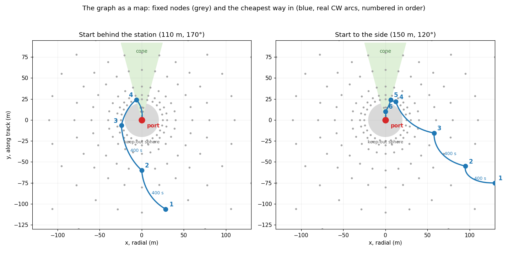

# Part 3 — A graph of exact manoeuvres as a map

Part 3 of [Orbital Rendezvous](../../README.md). [Part 2](../2_oriented_port/README.md)
found that docking through the port is a problem of finding the way round the
station, not of flying it: model-free reinforcement learning stops at a median
of 118 of 200, while searches dock 195 to 198 times, at the price of a value
written by hand or minutes of computing per flight. This part computes the way
instead, from the structure of the problem: the Clohessy-Wiltshire dynamics
are linear and solved in closed form, so the exact manoeuvre between two
points is known, and a graph of such manoeuvres gives every cheapest way in.



*The graph's nodes (grey), and the cheapest way in from two starts (blue,
along the real arcs of the transfers). From behind the station the shortest
path goes round the left side; nobody wrote that.*

**Key results**, on the 200 starts of Part 2, never seen:

- the graph pilot docks **195 of 200**, **47 of 47 from behind the station**,
  with no teacher and no way written by hand, in about 10 ms per decision; the
  200 flights take under half a minute on a laptop, where Go-Explore needed
  about 4 hours for 198;
- with a thrust error of 10 % in magnitude and 3° in direction on every step,
  it docks **198 of 200**, where the plan found once by Go-Explore and flown
  without replanning docked 9;
- distilled into **one neural network** by imitation with DART, on 12 000 of
  the pilot's flights, it gives a student that docks **173 and 180 of 200** on
  two training seeds, **39–40 of 47 from behind the station** where model-free
  reinforcement learning from scratch docked 1 to 4, and 175–178 with thrust
  errors, on 1.40–1.43 m/s: the way round the station, which nobody wrote,
  learned by a network that decides in under a millisecond.

## Contents

1. [Physics](#physics)
2. [Method](#method)
3. [Baselines](#baselines)
4. [Results](#results)
5. [Discussion and limitations](#discussion-and-limitations)
6. [Getting started](#getting-started)
7. [Layout](#layout)
8. [Tests](#tests)
9. [Roadmap](#roadmap)
10. [References](#references)

## Physics

Between two points $`\mathbf{p}_i`$ and $`\mathbf{p}_j`$, in a time of flight
$`T`$, the state transition matrix of the Clohessy-Wiltshire equations, split
into position and velocity blocks, gives the departure velocity in closed form,

```math
\mathbf{v}_0^{+} = \Phi_{rv}^{-1}(T)\,\big(\mathbf{p}_j - \Phi_{rr}(T)\,\mathbf{p}_i\big),
\qquad
\Delta\mathbf{v}_1 = \mathbf{v}_0^{+} - \mathbf{v}_0,
\qquad
\Delta\mathbf{v}_2 = -\big(\Phi_{vr}(T)\,\mathbf{p}_i + \Phi_{vv}(T)\,\mathbf{v}_0^{+}\big)
```

the two-impulse transfer of Part 1, now between any two points. Its arc is
known at every instant, $`\mathbf{r}(t) = \Phi_{rr}(t)\,\mathbf{p}_i + \Phi_{rv}(t)\,\mathbf{v}_0^{+}`$,
so whether it crosses the keep-out sphere outside the cone can be checked
before it is flown. Impulses are an idealisation of the thruster, at most
$`a_\text{max} = u_\text{max}/m = 2\ \text{mm/s}^2`$: an impulse of 0.2 m/s
takes 100 s to give.

## Method

**1. Nodes.** 201 points round the station: rings at 25 to 200 m every 15°,
and inside the keep-out sphere only the approach cone; the port is the origin.

**2. Edges.** The exact transfer between nodes at most 60 m apart, for times of
flight of 200, 400 and 800 s, kept only if its arc is legal, sampled at 30
points, and if each impulse can be given in a quarter of the flight,

```math
|\Delta\mathbf{v}_{1,2}| \le \min\big(0.3\ \text{m/s},\ \tfrac14\,a_\text{max}\,T\big)
```

6732 edges. The graph is built in under a second.

**3. The cheapest way in.** Dijkstra from the port, on the cost
$`c_{ij} = |\Delta\mathbf{v}_1| + |\Delta\mathbf{v}_2| + \lambda T`$ with
$`\lambda = 0.001`$ m/s per s. Every node reaches the port; from behind the
station the cheapest way goes round one side, and the side comes out of the
shortest path. Along it, each node gets a value in the units of the reward,
$`V(\mathbf{p}) = \gamma^{T_\text{tot}/\Delta t}\cdot 100 - w_f\,\Delta v_\text{tot}`$.

**4. The graph as a map** (`GraphPilot`). From its start the chaser picks the
node it can best reach, and the graph's cheapest way from there. A sampling
MPC with a horizon of 100 s flies towards the current node, its value beyond
the horizon the distance to that node; within 5 m of it the next node becomes
the target. Inside the cone the MPC flies the descent, valued by the glide
slope of the task, $`v(r) = v_d + r/\tau`$, which takes
$`t(r) = \tau\,\ln(1 + r/(v_d\,\tau))`$. If the chaser makes no progress for 60
steps, or drifts away from its target, the way is planned again from where it
is. The MPC plans with a docking speed of 80 % of the true limit.

**5. A network that flies like the pilot** (`planning/distill.py`). The graph
pilot flies 12 000 training starts; every step records the observation and the
pilot's command as a label, while the thrust actually applied carries noise
(DART: 0.1 of full thrust beyond 40 m, 0.02 within), so that the chaser drifts
off the way and the pilot, who replans, shows how to come back. A network with
two heads, as in Step 20, learns from it: a mode, straight in or round either
side, read from the side of the way's node furthest round and chosen once,
and a thrust that sees the mode, with steps within 20 m weighted ten times.
The student kept is the one that docks most often on 100 validation starts.
For this the graph keeps its arcs 5° inside the cone and, inside the keep-out
sphere, under the glide slope $`|\mathbf{v}| \le v_d + r/\tau`$ with
$`\tau = 400`$ s, so that the way in is slow where the corridor is narrow. On
the rim itself the student, a couple of degrees off, entered the sphere outside
the cone 62 times in 200; along one fast arc down the axis it could not hold
the cone from the front.

**What did not work first: the graph as the planner's value.** The design
began with the graph's value at the end of the MPC's horizon, as in Step 26.
It did not dock once, in four forms, each failing for a measured reason:

| form | where the chaser stopped | why |
| --- | --- | --- |
| value of impulsive transfers, horizon 200 s | 8–10 m from the port | an impulsive stop at the port promised an easy docking later, and the planner, replanning each step, put it off |
| impulses limited by the thruster, nearly continuous times | 10 m from the port | from anywhere near the port the end of the horizon was the same, so progress now paid nothing |
| without the port as a target, glide-slope value in the cone | out to 10–14 m | the value near the port no longer grew towards it |
| the same, horizon 100 s | 6 of 6 docked from 2–10 m; from behind, parked on a node 80 m out | impulsive values and a weak continuous thruster disagree between nodes |

Used as a value, the graph promised what the thruster cannot do; used as a
map, it decides only where to go, and the MPC only how to reach the next
point, which it does well.

## Baselines

The V-bar procedure of Part 2, and every method of Part 2 on the same 200
starts: model-free reinforcement learning, the sampling planner with a written
or a learned value, Go-Explore.

## Results

On the 200 unseen starts:

| method | how it knows the way | docked | from behind | $`\Delta v`$ | time | computing |
| --- | --- | --- | --- | --- | --- | --- |
| V-bar procedure | written by hand | 200 | 47 / 47 | 1.06–1.23 m/s | 1400–1775 s | — |
| **graph pilot** | **graph of exact manoeuvres** | **195** | **47 / 47** | 1.75 m/s | 1050 s | **10 ms per decision** |
| **its student, one network** (two seeds) | **imitation of the graph pilot** | **173–180** | **39–40 / 47** | 1.40–1.43 m/s | 1020 s | under 1 ms per decision |
| Go-Explore as a planner | search from saved states | 198 | 46 / 47 | 1.88 m/s | 2035 s | 5.4 min per flight |
| planner, value written by hand | search + geometry by hand | 195 | 45 / 47 | 1.13 m/s | 1260 s | 0.1 s per decision |
| RL from scratch, median of six seeds | trial and error | 118 | 1–4 / 47 | — | — | — |

How the student got there, one change at a time:

| student | flights | docked | 0–45° | 45–90° | 90–135° | 135–180° |
| --- | --- | --- | --- | --- | --- | --- |
| teacher on the rim of the cone | 4000 | 126 | 31 / 41 | 27 / 56 | 40 / 56 | 28 / 47 |
| arcs 5° inside the cone | 4000 | 133 | 15 / 41 | 29 / 56 | 46 / 56 | 43 / 47 |
| and under the glide slope inside the sphere | 4000 | 136 | 31 / 41 | 42 / 56 | 29 / 56 | 34 / 47 |
| the same teacher, three times the flights, seed 0 | 12 000 | **180** | 37 / 41 | 53 / 56 | 51 / 56 | 39 / 47 |
| the same, seed 1 | 12 000 | **173** | 34 / 41 | 47 / 56 | 52 / 56 | 40 / 47 |

Changes to the teacher moved the failures between directions and left the
total near 130; three times the flights moved the total to 173–180, on two
seeds that agree within seven dockings. Its failures are keep-out violations.
It spends less than its teacher, 1.4 against 1.75 m/s.

With a thrust error of 10 % in magnitude and 3° in direction on every step:

| method | docked |
| --- | --- |
| graph pilot, planning with a margin of 80 % on the docking speed | **198 / 200** |
| its student, two seeds | **175 and 178 / 200** |
| graph pilot, planning at the docking speed itself | 130 / 200, 69 crashes at the port |
| Go-Explore's plan flown open loop | 9 / 200 |

The five failures without errors are keep-out violations. Before the cone
margin and the glide slope of the distillation (above), the pilot docked 198,
and 199 with errors; slowing its way in cost it three dockings and made it
something a network could learn.

## Discussion and limitations

**What it shows.** The corridor that model-free reinforcement learning could
not learn is solved by computing, from the dynamics, the exact manoeuvres
between points and the cheapest way through them. No way is written by hand:
the side round the station comes out of a shortest path. Flown as a map by a
short-horizon MPC that replans, it is reliable, robust to thrust errors and
fast enough for a flight computer.

**Where learning comes in.** Blocks 1 to 4 are planning and control: a graph,
a shortest path, an MPC. Block 5 brings learning back where it can work: the
pilot can be asked what to do from any state, as the teacher of Step 20 could,
and its student learns the way round the station, 39–40 of 47 from behind.
At 173–180 of 200 it is short of its teacher, 195, and of Step 20's student,
596 of 600, which learned from a hand-written plan; the amount of data
mattered more than any change to the teacher.

**Where it costs more.** 1.75 m/s against 1.06–1.23 for the procedure: the
cost of time in the graph, $`\lambda = 0.001`$, and the approach to each node
at speed favour a quick flight; the weight was not tuned.

**What is left out.** Impulses between nodes are an idealisation, met only
because the MPC flies to each node rather than along its arc. Errors were
tested on thrust only, not on navigation. The model is planar, linear and
deterministic, on a circular orbit, as in Parts 1 and 2.

**Where it is not novel.** Sampling-based planning on CWH dynamics with
two-impulse steering is the line of Starek, Pavone and co-authors [13]. What
this part adds is the use of such a graph as a map for a short-horizon
sampling MPC on a weak continuous thruster, the measured reasons why using it
as the MPC's value fails, and the comparison on one task with model-free
reinforcement learning, learned values and Go-Explore.

## Getting started

Install as in [Part 1](../1_free_docking/README.md#installation), and run from
the root of the repository.

| script | what it does |
| --- | --- |
| `graph_eval.py` | the graph pilot on the 200 unseen starts, with optional thrust errors; adds a row to `assets/graph_pilot.json` |
| `graph_map.py` | the figure above: the nodes and the cheapest way in from two starts |
| `distill.py` | block 5: collects the pilot's flights with DART noise, trains the student, evaluates it; resumable by phase |

```bash
python studies/3_graph_planner/scripts/graph_eval.py                                  # about 20 s
python studies/3_graph_planner/scripts/graph_eval.py --thrust-error 0.1 --angle-error 3
python studies/3_graph_planner/scripts/graph_map.py
caffeinate -ims python studies/3_graph_planner/scripts/distill.py --run runs/distill/seed0   # about 1 h 15 min
```

As a library:

```python
from orbital_rendezvous import RendezvousEnv
from orbital_rendezvous.core.evaluation import rollout
from orbital_rendezvous.core.utils import build_configs, load_config
from orbital_rendezvous.planning.graph import CWGraph, GraphPilot

env = RendezvousEnv(*build_configs(load_config("studies/2_oriented_port/configs/ppo_corridor.yaml")))
pilot = GraphPilot(env, CWGraph(env), seed=0)
print(rollout(env, pilot, seed=10_000).outcome)
```

## Layout

```
studies/3_graph_planner/
├── README.md            # this write-up
├── scripts/
│   ├── graph_eval.py    # the graph pilot on the 200 unseen starts
│   ├── graph_map.py     # the map figure
│   └── distill.py       # the pilot distilled into one network
└── assets/              # graph_map.png, graph_pilot.json, student.json
```

The graph and the pilot are in `src/orbital_rendezvous/planning/graph.py`, the
student in `planning/distill.py`; the
sampling MPC they use is Part 2's `planning/mpc.py`.

## Tests

```bash
pytest tests/planning/test_graph.py tests/planning/test_distill.py
```

- **Edges.** A transfer flown with the closed-form propagation lands on its
  node to $`10^{-9}`$ m; an arc through the sphere outside the cone is
  rejected, one down the cone accepted (a long one is bowed out of the cone by
  the Coriolis term, which is the corridor's difficulty); an impulse is
  limited to what the thruster gives in a quarter of the flight.
- **Value.** The port is worth the bonus and every node less; every node has a
  way in; along the axis, and beyond 60 m in every direction, further is worth
  less, while beside the sphere a node 25 m out is worth less than one 60 m
  out, which reaches the cone in one manoeuvre; from behind the station the
  cheapest way goes round one side only; down the cone the value grows towards
  the port; a state with no legal way gets the fallback.
- **Pilot.** From behind the station it docks round one side with no
  violation; it plans with the margin on the docking speed while the rule
  stays the true one; the descent starts only inside the cone.
- **Student.** The mode names the side the way goes round, read from the node
  furthest round and not from the mouth of the cone; the labels are the
  teacher's commands, not the noisy thrust applied; the student keeps its
  first mode; training fits the labels and keeps the best student on
  validation, not the last.

## Roadmap

Step 28, with what failed first, is in **[ROADMAP.md](../../ROADMAP.md)**.

## References

The numbering continues that of [Part 2](../2_oriented_port/README.md#references);
reference 13 is J. A. Starek, E. Schmerling, G. D. Maher, B. W. Barbee &
M. Pavone, *Fast, Safe, Propellant-Efficient Spacecraft Motion Planning Under
Clohessy–Wiltshire–Hill Dynamics*, J. Guid. Control Dyn. **40**, 418 (2017).

## License

MIT, Lorenzo Monti; see [LICENSE](../../LICENSE).
